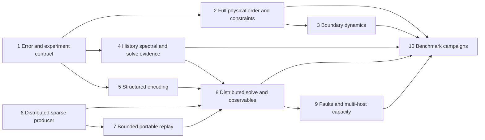

# quest-cfd next-step implementation plan

> **For agentic workers:** Use `superpowers:subagent-driven-development` or
> `superpowers:executing-plans` when implementing this plan. Checkboxes track
> future deliverables; this document does not claim that they have been completed.

**Goal:** Complete and validate the full-DG nonlinear KvN/global-history QSVT
route, including source preparation and execution beyond one node's memory.

**Architecture:** Preserve every independent physical DG velocity coordinate,
then apply the half-density KvN lift and solve one causal DG history system.
Keep physical discretization, operator recipes, stored sparse preprocessing,
quantum synthesis, simulator execution and observation as separately admitted
components with explicit costs and error evidence.

**Tech stack:** Rust workspace, triangular/tetrahedral BDM/P finite elements,
`quest-numerics`, `quest-qsvt`, `quest-qsp`, `quest-qsvt-io`, QuEST CPU and matching
rsmpi/native MPI; independent bounded classical references.

**Spec:** [Approved implementation plan](../../docs/superpowers/plans/2026-10-04-quest-cfd.md),
[method and theory](docs/method-and-theory.md),
[quantum/distributed contract](docs/quantum-and-distributed.md).

**Workspace programme:** The approved
[sparse operators, MathCore and dual-history implementation programme](../../docs/superpowers/plans/2026-10-05-sparse-mathcore-cfd.md)
extends this backlog. Its delivery order takes precedence over the sequence
below: sparse/MPI foundations, workspace MathCore consolidation, encoding
portfolio, Burgers/Carleman, KdV and the remaining DG foundation, then campaigns.
The numbered CFD tasks below retain their acceptance requirements. The new
Carleman route is an explicitly truncated comparison solver over the same full
physical coordinates; it does not replace full-KvN acceptance.

The programme also makes workspace-wide MathCore consolidation an implementation
requirement: shared algebra must replace duplicate implementations and have
real consumers in the symbolic, numerical, polynomial, language/compiler,
QSP/QSVT and CFD layers. Adding an unused optional dependency is insufficient.

Matching resources now use [version-two record fingerprints](../../docs/verification/2026-10-06-sparse-record-fingerprints.md),
with explicit rejection of old persisted manifests. The
[portfolio identity repair](../../docs/verification/2026-10-06-portfolio-source-fingerprints.md)
also covers weighted and structured source records. Both retain separate
operator and unitary identities, charge digest work/storage where their APIs
support those budgets, and preserve historical evidence. These are integrity
corrections, not new physical-accuracy or capacity results.

The [persisted weighted inverse campaign](../../docs/verification/2026-10-06-persisted-weighted-transform.md)
now connects publication from eight ranks, one phase compilation and reuse of
the same files on 1/2/4/8 ranks and split groups. Its fixed dimension-32 inverse
passes the declared residual criterion. Physical-history decompositions,
equal-accuracy comparisons and actual multi-host capacity remain distinct work.

**Status date:** 2026-10-06. This is a development backlog and proposed sequence,
not an implementation or benchmark acceptance report. File names marked
**proposed** below do not denote existing APIs. Paths beginning `src/`, `tests/`
and `cases/` are relative to this crate; `crates/...` paths are relative to the
workspace root. Commands run from the workspace root.

## Starting point and evidence

The [2026-10-04 acceptance record](../../docs/verification/2026-10-04-quest-cfd.md)
records a complete five-coordinate nonlinear smoke circuit: 17 simulated qubits,
degree 401, and approximately `5.26e-6` relative history residual on both scalar
and QuEST CPU backends. It also records 1/2/4/8-rank matching tests, split
communicators, source-integrity checks and native mid-execution abort coverage.
Those are dated results, not checks rerun while writing this document.

The [dual-history implementation evidence](../../docs/verification/2026-10-05-dual-history.md)
records the newer scoped results. The full programme remains open; the detailed
checkboxes below describe acceptance gates, including obligations beyond the
implemented APIs.

Additional current scope is documented by the [generated MPI history consumers](docs/distributed-history.md),
[complete distributed box-drift history](../../docs/verification/2026-10-05-generated-box-kvn-history.md),
[generated polynomial-time box data and history](docs/generated-time-boundaries.md),
[KvN configuration diagnostics](docs/kvn-refinement.md),
[bounded portfolio comparison](../quest-qsvt/docs/portfolio-comparison.md) and
[real capped local sparse pipeline](../../docs/verification/2026-10-05-sparse-capacity.md).
Those chapters distinguish modeled memory, actual process caps, numerical checks
and unresolved physical accuracy; historical test totals are not current-tree acceptance.

The [paired-history fixture](docs/paired-history.md) now initializes both lifts
from the same complete sampled ensemble and compares their physical moments with
trajectories of the original DG system. Its dated receipts preserve resource
rejections separately from successful histories. The
[exterior configuration-flux diagnostic](../../docs/verification/2026-10-06-configuration-flux.md)
also distinguishes inward/outward trace rates from outer-cell occupation. These
APIs support Task 1; neither establishes integrated leakage or independent
configuration/regularization convergence.

The [initial weak-generator diagnostic](docs/configuration-weak.md) adds complete
complex-amplitude contractions and original-force coordinate/energy comparisons.
Its [focused verification](../../docs/verification/2026-10-06-configuration-weak.md)
retains the larger DG2 work rejection. The subsequent
[seven-row fixed campaign](../../docs/verification/2026-10-06-configuration-weak-campaign.md)
completed three requests and retained three work rejections and one sampling
rejection. Initial mean bias and a constant-energy support degeneracy prevent a
configuration-convergence claim. A separate
[DG2/two-cell diagnostic](../../docs/verification/2026-10-06-configuration-weak-energy-shell-v2.md)
completed with nonconstant occupied energy, but retained unresolved
concentration and a larger energy-rate defect under changed quadrature.
Resolving those errors and global-history
convergence remain open; this initial-rate operation does not replace either.

The [closed affine mesh stage](docs/affine-mesh.md) extends Task 2 with complete
BDM1/P0 and BDM2/P1 spaces on admitted unequal cells, shared exact MathCore
geometry, topology checks, weighted pressure and polynomial boundary data. Its
[verification and runnable exact fixtures](../../docs/verification/2026-10-06-affine-mesh.md)
retain the full spaces and explicit constructor/query limits. The subsequent
[mixed-boundary foundation](docs/mixed-traction.md) adds explicit velocity and
mechanical-traction facets, full open-domain rank, absolute pressure and
canonical polynomial-time lifting. Its
[exact and runtime evidence](../../docs/verification/2026-10-06-mixed-traction.md)
is limited to bounded affine assembly. Curved and mixed-order meshes,
generated distributed arbitrary geometry and physical convergence remain open;
neither stage closes Task 2's gate.

The [P2 cylinder snapshot](docs/cylinder-high-order.md) applies that foundation
to a versioned polygonal DFG source and complete quadratic inlet data. Its
[fixed exact-rank calculation](../../docs/verification/2026-10-06-cylinder-p2.md)
retains all 54 independent coordinates. The later [bounded evolution](docs/cylinder-p2-evolution.md)
advances that full space over `[0,0.0001]`; its [three-row record](../../docs/verification/2026-10-06-cylinder-p2-evolution.md)
preserves completed integration separately from failed temporal accuracy. The
official DFG measurement cycle remains open.

| Area | Implemented and scoped-tested foundation | Remaining acceptance |
| --- | --- | --- |
| Shared algebra | Maintained MathCore exact/dynamic/polynomial/backend foundation; migrated consumers and prepared physical kernels ([contract](../../docs/research/shared-algebra.md)) | Final workspace checks and cross-platform acceptance |
| Physical DG | Full BDM1/P0 and BDM2/P1 box/affine spaces; [complete polynomial-time lifting, prescribed traces and body forces](../../docs/verification/2026-10-05-polynomial-boundary-lifting.md); [bounded mixed traction and canonical lifting](docs/mixed-traction.md); original-coordinate pressure recovery; [owned-cell polynomial-time box lifting, traces, body force, drift/pressure and history construction](docs/generated-time-boundaries.md) with explicit cost | Distributed arbitrary mixed/curved geometry, nonpolynomial boundary functions, literal 3D wake pressure/outlet closure |
| Lift/time | Full KvN configuration DG; complete ordered/symmetric Carleman references; stateless Carleman and full-coordinate KvN row/scalar consumers; forced DG1/DG2 streamed inverse | Independent physical/configuration/domain/regularization convergence; longer-history conditioning and certified generated spectra |
| Carleman evidence | Actual coefficient bounds; optional logarithmic-contraction/scaled-forcing truncation bound; Burgers/KdV order studies | Conservation-aware certificates with all means; validated total reconstruction errors and accuracy-dependent orders |
| Encodings | Matching baseline, weighted LCU/tensor sums, supported SCC arithmetic constructions, explicit sparse-access QROM; compact schedules, independent same-matrix comparison and constructed portable resource curves; [prepared matching weighted composition on CPU/MPI](../../docs/verification/2026-10-06-distributed-weighted-matching.md) and its [owning QSVT transform](../../docs/verification/2026-10-06-prepared-lcu-transform.md), with whole-unitary, independent polynomial/inverse and collective-failure evidence | Distributed tensor and persisted-resource portfolio extensions, physical-history decomposition, native/equal-accuracy comparisons across sizes, approximation contracts for later compression |
| Sparse execution | Generated sharded producer, immutable HDF5 resources, bounded replay, local-owner CPU/MPI matching, coherent RHS, streamed inverse and real capped local pipeline; [consuming persisted preparation](../../docs/verification/2026-10-06-persisted-matching-preparation.md), [actual-capacity loader admission](../../docs/verification/2026-10-06-persisted-matching-loading.md) and [cumulative composition routing receipts](../../docs/verification/2026-10-06-prepared-routing-telemetry.md); [same-file weighted inverse execution](../../docs/verification/2026-10-06-persisted-weighted-transform.md); [Cirrus execution and scaling on 2/4/8 nodes](../../docs/verification/2026-10-06-cirrus-capacity.md); [real large-count chunked transport](../../docs/verification/2026-10-06-large-count-mpi.md) | Broader physical-history portfolio integration; additional fault classes; completed execution with canonical input larger than each node's verified cap |
| Constraints | Cell-whitened distributed Householder chart; generated BDM1/BDM2 box constraints; full null-tail queries; independently reviewed supplied-force pressure/gauge wrapper and complete generated physical drift, tested at 1/2/4/8 ranks and split communicators; collectively scheduled full-coordinate autonomous and polynomial-time box KvN history construction | Certified numerical-rank/pressure error and larger-mesh physical/history convergence |
| Physical cases | Six physical manifests; coarse snapshots; full-coordinate Burgers/doubled-field KdV demonstrations; bounded refinements; 3D cavity transverse-plane and reflection diagnostics; completed coarse BDM1 DFG eight-second classical window with no resolved shedding frequency; complete P2 cylinder snapshot and bounded trajectory consumer with retained temporal accuracy failure | Accepted P2 temporal accuracy; published-window/profile/force convergence, geometry studies, literal 3D wake execution |
| Observables | Reviewed probability-weighted KvN energy and exact temporal-node readout; [bounded prepared physical observables](docs/physical-observation-recovery.md); conditional shot estimates; [coherent temporal interpolation](docs/temporal-observations.md); [composed CPU/MPI inverse/time postselection and readout](docs/distributed-temporal-observation.md), with explicit slab/side, original-normalized joint probability and physical scale | General coherent pressure/traction/value oracles; validated systematic bias and repeated measurement campaigns including every temporal preparation/execution cost |
| Estimates | Arbitrary-width untruncated KvN and complete symmetric Carleman dimensions; [constructed H-adjoint/RHS/inverse costs](docs/constructed-resources.md), actual layout/ancilla counts, conditional sampling work and twelve DG1/DG2 curves retaining rejected stages | Accuracy-dependent mesh/order/precision and broader benchmark comparisons; certified joint success and systematic observable error |

The 512 MiB-capped classical campaign is a small local reference study; it does
not test stored input larger than one node. Its short Navier–Stokes transients
are not the published measurement windows. The full-T=0.1 scalar demonstrations
remain separate from the executed Burgers quantum inverses. The later
[full T=0.1 Burgers run](../../docs/verification/2026-10-05-dual-history.md#full-frozen-burgers-window)
uses bounded interval spectral evidence and retains its omitted phase certificate
and coarse physical-error limits.
The separately [capped DFG window](../../docs/verification/2026-10-05-cylinder-window.md)
does reach `[4,8]`, but its coarse polygon produces nearly constant asymmetric
lift and no admitted Strouhal candidate. This is recorded as an unresolved
physical result, with explicit geometry error, rather than benchmark acceptance.

The later [full-window box campaign](../../docs/verification/2026-10-06-box-windows.md)
reaches T=10/20 for Taylor–Green and T=100 for both cavities, with independent
physical-order/mesh and selected temporal comparisons. Its 44 completed
snapshots across 50 attempts retain chart-size and unstable-step rejections.
They are coarse classical results; the published-profile/continuum acceptance
above remains open. The higher-order reference has an explicit, reported
integration-work override with its old default preserved.

The optional `--certify-carleman` route applies only to `--lift carleman` with
`reference`, `build`, or `solve`. It certifies continuous hierarchy truncation
for the recorded polynomial ODE under explicitly checked sufficient conditions;
it does not certify all solver errors. Estimates cannot satisfy this flag.

## Global constraints

* Retain the entire homogeneous constraint kernel. No POD, selected modes,
  dropped physical coordinates, or hybrid nonlinear substitution in the primary
  route. Exact constraint elimination is allowed and its cost is counted.
* Preserve smooth central/split convection and a justified SIP viscous operator.
  Do not introduce switching limiters without changing the mathematical contract.
* Use weighted adjoints and mass-weighted configuration amplitudes. A small
  algebraic skew residual does not establish consistency or convergence.
* Apply QSVT directly to the non-Hermitian history operator with the correct
  adjoint orientation. Do not form normal equations.
* Refine initial width, configuration extent, configuration approximation,
  physical approximation, time approximation and cylinder geometry independently.
* No rank in the production distributed path may require complete CSR/CSC,
  a dense dilation, the full gate stream or a global statevector.
* Preserve complex phases, unsuccessful branches, padding, spectators, signed
  controls and adjoints. Projected-block agreement alone is insufficient.
* Keep construction, classical execution, quantum-circuit simulation, resource
  rejection, and physical benchmark convergence as distinct report outcomes.
* Treat CPU/MPI as the first optimization target. Unsupported accelerator paths
  must fail admission explicitly. Preserve existing supported native workflows.
* Match QuEST, `MPICC` and `mpiexec` MPI implementations. Generic paths belong in
  documentation; local runs do not close actual multi-host requirements.

## Review focus

1. Unequal cells, curved facets and nonuniform order must preserve pressure
   gauge, complete constraint rank and reconstruction; Task 2 owns these tests.
2. Narrow initial support and viscous concentration must not disappear through
   unresolved quadrature or periodic boundary wrapping; Task 1 owns these tests.
3. Non-normal histories, weak singular gaps and terminal-time postselection
   must retain scaling, probability and conditioning evidence; Tasks 4 and 8
   own these tests.
4. Missing/duplicated/altered shards and rank-dependent budgets must reject
   collectively before execution; Tasks 6 and 9 own these tests.
5. Allocation or transport failures after state mutation must terminate within
   a bounded deadline without leaving peers blocked; Task 9 owns these tests.

## Sequence and parallel work

Within the original CFD backlog, start with Task 1's error/experiment contract and Task 6's distributed source
contract. They address the two largest gaps between the present smoke test and
scientific use. Physical work (Tasks 2–3), spectral work (Task 4), and structured
encoding work (Task 5) can then proceed independently against those contracts.
Tasks 7–9 integrate the distributed path; Task 10 runs campaigns only after the
operators and observation definitions they use are validated.



### Task 1 — Separate numerical errors and automate full-DG refinements

**Files:** Extend [configuration](src/configuration.rs),
[validation](src/validation.rs), [history](src/history.rs) and
[CLI](src/main.rs). Proposed: `src/campaign.rs`, `tests/campaign.rs` and a
workspace `docs/verification/fixtures/quest-cfd/refine.py` driver.

**Interfaces:** Consume `ConfigurationGrid`, `HistorySystem`,
`compare_full_dg_transport` and `SolveReport`. Produce versioned campaign records
that retain all approximation parameters, the complete physical dimension,
operator/source identity, error convention, status, budgets and timings.

- [ ] Define separately measured or bounded contributions for physical DG,
  boundary geometry, regularization, configuration discretization/domain, time,
  encoding, polynomial, floating execution and sampling. Do not sum unrelated
  norms and call the result an end-to-end bound.
- [ ] Add rejecting tests for zero sampled initial support, unresolved
  concentration, nonfinite observables, negative/unknown budgets and missing
  provenance. Mark outer-cell mass as a boundary-occupation diagnostic, not a
  measured outward flux or certified leakage error.
- [ ] Compare lifted evolution with an ensemble of trajectories of the identical
  complete DG ODE, then independently approach the narrow deterministic limit.
  Record weak observable errors as well as state/probability diagnostics.
- [ ] Run one-axis-at-a-time refinements before combined runs. Record resource
  rejections rather than shrinking the physical chart to fit a budget.

**Gate:** A reproducible full five-coordinate nonlinear campaign identifies
which error is decreasing, which remains unresolved, and why. Convergence of a
constant-drift wave alone does not pass this gate.

**Check:** `cargo test -p quest-cfd --test kvn_history --test transport`, followed
by the proposed campaign target once added.

### Task 2 — Higher physical BDM order and scalable complete constraints

**Files:** Extend [simplex](src/simplex.rs), [physical cases](src/cases.rs),
[resource accounting](src/resources.rs), [simplex tests](tests/simplex.rs) and
[lifting tests](tests/lifting.rs). Proposed: `src/physical_space.rs`,
`src/constraints.rs`, `tests/physical_order.rs`.

**Interfaces:** Generalize the current BDM1 chart while preserving a complete
physical-state interface: dimension/rank, reconstruction, drift, pressure,
continuity and energy. Keep `PeriodicBdm1` as an independent reference. Any new
matrix-free representation must still define all independent coordinates and
how a drift query in those coordinates is evaluated.

- [ ] Implement and independently count BDM2/P1 on triangles and tetrahedra,
  including oriented facet moments, Piola maps and interior moments. Count the
  local BDM degree and actual global constraint rank before constructing the
  configuration tensor; do not extrapolate the BDM1 rank formula blindly.
- [ ] Add unequal-volume, periodic, mixed-boundary and nonuniform-order tests
  for divergence, normal traces, mass orthogonality and weighted pressure gauge.
  Verify high-order mass/flux quadrature and SIP coercivity/order scaling.
- [ ] Compare an exact implicit pressure/projection implementation with the
  bounded dense chart on small meshes. Count factorization, iteration and global
  communication work per drift query, including nested solves.
- [ ] Add physical h/p manufactured and Taylor–Green refinements. Preserve
  explicit rejection where scalable construction has not yet been implemented.

**Gate:** Every physical coordinate is retained at each order, the reconstructed
momentum equations close, and physical h/p errors decrease independently of the
configuration discretization. A faster projection alone does not establish an
efficient coherent quantum drift oracle.

### Task 3 — Time-dependent lifting and the approved 3D wake boundaries

**Files:** Extend [boundary assembly](src/simplex.rs),
[cylinder](src/cylinder.rs), [case manifests](cases), and
[cylinder tests](tests/cylinder.rs). Proposed: `src/boundary.rs`,
`tests/boundary_dynamics.rs`.

**Interfaces:** Define the treatment of prescribed boundary data, their time
derivatives, boundary mass terms and any additional dynamical unknowns before
extending `drift`. If lifting depends on time, retain its derivative in the
complete constrained ODE. A nonautonomous lift must be evaluated consistently
at temporal quadrature nodes in the global history.

- [x] Write manufactured time-dependent lifting tests with original-coordinate
  momentum and continuity residuals, not only a projected-coordinate check.
  The bounded polynomial reference and generated owned-cell box source cover
  BDM1/P0 and BDM2/P1 in 2D/3D, complete prescribed traces/body forces, retained
  homogeneous lifting, `ell_dot`, physical pressure and exact temporal-node
  evaluation. MPI 1/2/4/8/split tests compare the complete history. See the
  [supported contract and limits](docs/generated-time-boundaries.md); these tests
  do not close the separate literal wake or convergence gates below.
- [ ] Derive and implement the 3D wake's Neumann far field and convective outlet,
  including their energy balance and initial/boundary compatibility. Count any
  added boundary state in the full KvN dimension.
- [ ] Preserve the stationary cylinder, Re300, periodic span `4D`, frozen domain
  and cycle requirement from [the manifest](cases/shedding3d.json). Do not replace
  the outlet with natural traction or turn this into a forced-cylinder case.
- [ ] Verify spanwise periodicity, flux balance, boundary work and manufactured
  outlet transport before enabling physical execution for this manifest.

**Gate:** The formerly unsupported 3D case executes its declared boundary
operator and passes classical refinement. Simply removing the rejection fails.

### Task 4 — Useful history spectral evidence and reciprocal error budgets

**Files:** Extend [history](src/history.rs), [solver](src/solve.rs),
`crates/quest-qsvt/src/reciprocal.rs`, [history tests](tests/kvn_history.rs) and
[solve tests](tests/solve.rs). Proposed: `tests/history_bounds.rs`.

**Interfaces:** Continue consuming `SpectralBounds`, `SpectralEvidence`,
`ReciprocalPolynomial`, RHS preparation and the owning encoding. Preserve the
existing evidence kinds; numerical observations must not become analytic proofs.

- [ ] Establish usable bounds for temporal DG2 and longer horizons. Test
  non-normal block histories and near-zero singular gaps against independently
  bounded small references. Keep valid construction available when a proof fails.
- [ ] Compare the current geometric reciprocal with better approximants using
  total certified query/normalization/success cost, not degree alone.
- [ ] If preconditioning is introduced, encode its action, account its cost and
  norm, retain the transformed RHS, and restore the physical unknown explicitly.
  No normal equations or uncharged classical inverse hidden inside an oracle.
- [ ] Propagate approximation, certified response and justified oracle/execution
  error through physical rescaling and observable estimation. Keep measured
  residuals as separate evidence and reject unmet tolerance budgets.

**Gate:** Correct inverse orientation and physical units hold on complex,
non-Hermitian examples; any conditioning improvement survives the cost of its
preconditioner and state preparation.

### Task 5 — Complete paper-specific structured encodings

**Files:** Extend `crates/quest-qsvt/src/structured.rs`,
`structured_stencil.rs` and their tests. Proposed in that crate:
`src/structured_base.rs`, `tests/structured_base.rs`.

**Interfaces:** Retain arithmetic source recipes, normalization, layout,
source identity, clean-workspace requirements, controls, adjoints and replay.
Separate symbolic dimension/resource descriptions from executable resources.

- [ ] Implement a reviewed base construction from
  [Sünderhauf–Campbell–Camps](https://arxiv.org/abs/2302.10949v2), with each required
  index-map and data-pattern identity stated in the API contract.
- [ ] Add PREP/UNPREP only after those identities are validated. Reject malformed
  recipes, unsupported patterns and uncomputed normalization bounds.
- [ ] Test extracted `A/alpha` and the whole unitary for complex data, zero rows,
  rectangular padding, failure sectors, clean ancillas, controls and adjoints.
- [ ] Compare against the stored matching baseline on actual DG/tensor/history
  operators. Include normalization, arithmetic gates, precision and setup cost.

**Gate:** At least one scientific operator family has a validated arithmetic
encoding with a justified cost improvement. A symbolic stencil or a PREP label
without a reversible implementation does not pass.

### Task 6 — Distributed sparse loading, matching and permutation preparation

**Files:** Extend `crates/quest-numerics/src/sparse.rs`,
`crates/quest-qsvt/src/matching_shard.rs`, and `crates/quest-qsvt-io/src/`.
Proposed: `crates/quest-qsvt-io/src/sharded_sparse.rs`,
`crates/quest/src/qsvt/matching/preprocess.rs` and focused integration tests.

**Interfaces:** Consume disjoint sparse input partitions and a common source
manifest; produce owned `MatchingShard::from_parts` records bound to one common
`MatchingHeader`. Choose MPI orchestration above the pure numerical/model layer.
No stage may require `MatchingShard::from_encoding` on a complete source.

- [ ] Freeze ownership, duplicate reduction order, explicit zeros, index width,
  shard format/version and integrity semantics before choosing a coloring scheme.
- [ ] Implement bounded input exchange, deterministic weighted matching and
  distributed reversible permutation completion. Account padding and `K beta`.
- [ ] Test missing/duplicate/altered shards, empty owners, severely imbalanced
  columns, rectangular padding and partition changes against a bounded canonical
  sparse reference. Check the represented matrix and whole-unitary semantics;
  require identical query source identity where a prepared source is reused.
- [ ] Report peak bytes, disk traffic, communication and maximum-rank times for
  reading, canonicalization, matching, completion and preparation separately.

**Gate:** A capped-memory run constructs the encoding from genuinely sharded
input without a complete-source allocation on any rank. A test that creates a
full matrix first and then discards it is insufficient.

### Task 7 — Bounded portable replay from distributed resources

**Files:** Extend `crates/quest-qsvt/src/replay.rs`, `replay_transform.rs`,
`crates/quest/src/qsvt/matching_transform.rs` and their tests. Proposed:
`crates/quest/tests/sharded_replay.rs`.

**Interfaces:** Consume immutable shard resources and source-bound
`MatchingSchedule`; emit bounded ordered gate chunks in forward and reverse
order. Preserve compatibility with existing `OracleFragment` callers.

- [ ] Specify replay order, checkpoint/chunk identity, reverse traversal and
  storage lifetime so replay never materializes the global gate stream.
- [ ] Make controlled and adjoint replay use the same source/layout semantics as
  native execution. Compare all amplitudes with the portable small reference.
- [ ] Test end-of-chunk failure, restart/reuse policy, changed metadata,
  inactive controls and separate communicator contexts.

**Gate:** Portable and fused paths agree on arbitrary whole-register states
while retaining only admitted chunks and owned source data per rank.

### Task 8 — Distributed CFD solve, RHS preparation and observables

**Files:** Extend [solver](src/solve.rs), [CLI](src/main.rs),
[configuration observables](src/configuration.rs),
`crates/quest/src/collective.rs` and native matching execution. Proposed:
`src/observables.rs`, `tests/distributed_solve.rs`.

**Interfaces:** Add an explicit distributed workflow using local-shard source
and RHS preparation, collectively admitted spectral/error evidence and reusable
prepared schedules. The current `--backend quest-cpu` CLI is a bounded local
workflow; a future distributed option must not silently reuse its full buffers.

- [x] Prepare the mass-weighted RHS by bounded local chunks with collective
  failure agreement. Track global normalization without broadcasting the state.
- [ ] Decode energy, broken-curl enstrophy, probes and pressure/traction-derived
  forces through specified operators/reductions. Count classical simulator
  reductions separately from a future quantum measurement algorithm.
- [x] Record success of the signal/flag projections and selected-time readout
  separately. Account normalization and temporal weights when converting a
  history-state observable to a physical-time observable. Exact DG nodal selection
  and arbitrary-time coherent interpolation with composed CPU/MPI postselection
  are implemented; repeated quantum measurement campaigns remain separate.
- [ ] Supply a sampling confidence/error contract and an admitted observable
  construction cost. Reserve full-field output for small explicitly budgeted
  references; record its output-size cost.

**Gate:** The same complete nonlinear smoke system agrees across scalar,
portable and distributed native execution for both states and physical
observables. No global RHS/state/observable table is necessary in the production
sharded path.

### Task 9 — Faults, scheduling efficiency and actual multi-host capacity

**Files:** Extend `crates/quest/src/qsvt/matching/`,
`crates/quest-sys/src/mpi.rs`, checked native adapters and MPI tests. Use
declarative Torc workflows for the proposed campaign orchestration, with a
versioned receipt schema and safe Rust scientific validation; do not add a new
Python capacity controller. The [Torc assessment](../../docs/research/torc-cirrus.md)
records the inspected source pin, supported configuration and deployment gates.

**Interfaces:** Reuse admitted buffers and a separate transport context. Preserve
count checks, ownership/lifetime rules and collective preflight; distinguish
recoverable admission errors from fatal errors after mutation.

The [Cirrus campaign](../../docs/verification/2026-10-06-cirrus-capacity.md)
now supplies actual two-, four- and eight-node execution, with one MPI rank per
exclusive node and native OpenMP enabled. It also records original input bytes,
enforced process caps, placement, stage timings and sampled node memory. The
canonical input remains below every cap, so this is execution/scaling evidence;
the capacity checkbox below remains open. Fixed-size end-to-end time increased
with node count, principally in the measured loading stage. Profile that stage's
work and communication before selecting an optimization or claiming a cause.
The [phase measurements](../../docs/verification/2026-10-06-matching-load-phases.md)
attribute about 95–98% of two-, four- and eight-node loading time to portable
replay admission in the measured optimized probe. Native resource loading now
has a separate checked entry point. Completed GNU/Cray comparisons preserve
forward-state hashes and roundtrip accuracy while reducing loading time.
The [controlled-profile storage bound](../../docs/research/distributed-capacity-memory.md)
shows that this particular two-register experiment cannot close the strict
capacity gate on eight or fewer nodes by increasing its input dimensions alone.
The [memory follow-up](../../docs/verification/2026-10-06-sparse-capacity-followup.md)
separates corrected producer accounting, native array payload and resource-only
loading from that still-open execution-design requirement.
The subsequent [buffer-reuse stage](../../docs/verification/2026-10-06-matching-buffer-reuse.md)
removes the second distributed register and passes local and GNU/Cray
whole-unitary, 1/2/4/8-rank and bounded post-mutation failure tests. It halves
actual native array payload while retaining the generic input reservation.
Operation-specific peak admission and verified whole-node enforcement remain
required; rank process limits alone cannot close strict capacity.
The [compute-node enforcement diagnostic](../../docs/verification/2026-10-06-node-enforcement.md)
observed a root-owned site job limit and no writable Slurm delegation. HugeTLB
coverage and a smaller aggregate application cap remain unverified. Resolve
that enforcement contract before claiming an oversized-input capacity result.
Under the user's documented-tools-only Cirrus policy, the small aggregate cap
is unsupported: record it and move on without custom process limits, cgroup
changes or replacement deployment mechanisms. The earlier capped runner is
retained for historical validation and local experiments; it rejects new Slurm
execution. The restricted-state design remains deferred.

- [ ] Establish a supported Torc server/database deployment, validate its manual
  Slurm/direct execution route and replace active Python orchestration. Keep
  genuine node requirements, the eight-node aggregate allocation limit and all
  failed attempts. Retain historical fixtures and receipts. Unsupported
  deployment requirements are reported without workarounds.
- [ ] Inject allocation failures before native construction and at agreed
  execution checkpoints, malformed count/data packets, delayed peers and
  mid-execution native failures. Enforce an external timeout and verify all peers
  return or terminate; preserve the existing native-abort regression.
- [x] Test large-count chunk logic with an injectable small test ceiling, then
  run an actual large-count environment. [GNU and Cray two-node probes](../../docs/verification/2026-10-06-large-count-mpi.md)
  exchanged and fully verified 2,147,483,664 bytes in each direction. Each native
  frame still fits a signed int; MPI-4 large-count calls were not exercised.
  Matching routing retains its separate bounded-message path.
- [ ] Replace replicated global-index scans/all-peer rounds where measurements
  justify it. Retest the whole unitary before reporting any speedup.
- [ ] Run 1/2/4/8 ranks and split communicators under local memory caps, then
  multiple hosts with stored sparse input larger than each node's memory cap.
  Record per-rank and per-node peak RSS, maximum-rank timings, send and receive
  bytes, setup versus repeated execution, failures, and source data residency.

**Gate:** Actual multi-host receipts demonstrate the stated capacity and bounded
failure behavior. Passing on one host or estimating a huge tensor remains a
separate result. If suitable hosts are unavailable, mark this gate unverified.

### Task 10 — Publish all six benchmark campaigns and full resource curves

**Files:** Extend [case manifests](cases), [case outputs](src/cases.rs),
[cylinder outputs](src/cylinder.rs), [resources](src/resources.rs) and campaign
fixtures/receipts. Preserve source provenance and manifest revisions.

| Family | Configurations | Required campaign outputs |
| --- | --- | --- |
| 2D Taylor–Green | Re100, periodic square | Analytic velocity/pressure errors; energy, enstrophy; h/p/time refinements |
| 3D Taylor–Green | Re100; Re1600 scale case | Energy, dissipation, enstrophy, complete refinement histories |
| 2D cavity | Re100, Re1000, unit square | Centerline profiles, vortex location and independently small steady residual |
| 3D cavity | Re100, Re1000, unit cube, stationary side/end walls | Midplane profiles, secondary circulation, symmetry and steady residual |
| DFG 2D-2 | Re100, official channel/cylinder | Drag, lift, pressure difference, periodic lift frequency/Strouhal |
| 3D stationary wake | Re300, periodic span `4D` | Mean drag, lift RMS, Strouhal, spanwise variation and at least 200 observed cycles |

- [ ] Freeze acceptance tolerances, nondimensionalization, initial conditions,
  transient rejection and observation windows before comparing results. Keep
  project-selected windows distinct from conditions explicitly prescribed by a
  published reference. Do not smooth the cavity lid discontinuity unnoticed.
- [ ] Establish classical references first, including cylinder geometry and
  physical h/p/time studies. State whether each reference is the identical
  semidiscrete ODE or an independent continuum benchmark comparison.
- [ ] Produce full untruncated KvN estimates for every physical mesh/order in
  the campaign. Report exact expressions beyond executable indexing limits;
  replace generic ancilla allowances with encoding-specific resource accounts.
- [ ] Execute quantum validation only for configurations that pass construction,
  memory, spectral, polynomial and error admission. Retain rejections. No
  estimate, mode removal or classical nonlinear substitute counts as a solve.

**Gate:** Each family has a reproducible classical acceptance record and full
resource estimates; only actually executed, verified configurations carry a
quantum validation claim. Passing one family does not promote the other five.

## Comparison experiments after the primary contracts are stable

The [alternatives chapter](docs/alternatives.md) gives decision criteria and
sources. First compare direct evolution of the same skew-adjoint full-KvN
operator with the global history inverse at equal physical error and observable
requirements. Then evaluate Schrödingerisation, alternative reciprocal synthesis,
and structure-aware preconditioning with their additional coordinates, recovery,
loading and measurement costs included. The approved workspace programme adds
Carleman as a separately labelled history-solver route, with coefficient and
stability evidence, order refinement, complete physical coordinates and distinct
preparation/readout costs. Hybrid Oseen/Newton updates and approximate tensor
compression remain later research alternatives. None closes the full-KvN
requirements by substitution.

## Verification and delivery for each implementation stage

A stage is reviewable when its source changes, independent regression evidence,
resource/error accounting and remaining limitations are recorded together.
Implementation should first reproduce its missing behavior or failure, then add
only the corresponding capability, run its focused tests and obtain independent
review. Integration or publication follows the user's repository instructions;
this backlog does not itself request commits, merges or pushes.

For integrated native changes, use a matching installed MPI environment and run:

```sh
export QUEST_ROOT=/path/to/installed/quest
export MPICC=/path/to/matching/mpicc
cargo nextest run --workspace --all-features --no-fail-fast
cargo test --workspace --all-features --doc
cargo clippy --workspace --all-features --all-targets --no-deps -- -D warnings
cargo fmt --all --check
cargo run --locked -p xtask -- generate-quest-bindings --check
```

Run relevant explicit MPI and capacity jobs as well; a Cargo feature flag does
not execute them by itself. Record platform restrictions, ignored tests and
unsupported accelerator paths. A later benchmark claim must point to its actual
manifest, source revision, command, budgets, errors and receipts.
