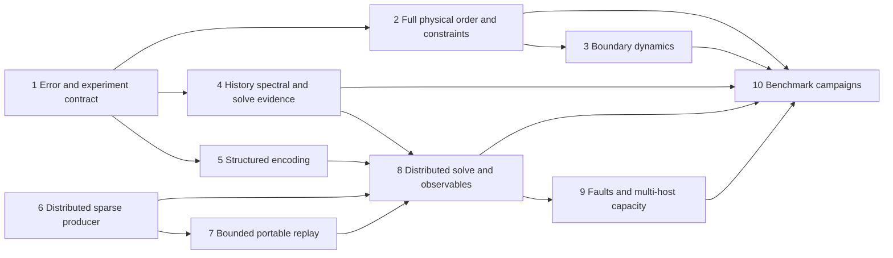

# quest-cfd next-step implementation plan

> **For agentic workers:** Use `superpowers:subagent-driven-development` or
> `superpowers:executing-plans` when implementing this plan. Checkboxes track
> future deliverables; this document does not claim that they have been completed.

**Goal:** Complete and validate the full-DG nonlinear KvN/global-history QSVT
route, including source preparation and execution beyond one node's memory.

**Architecture:** Preserve every independent physical DG velocity coordinate,
then apply the half-density KvN lift and solve one causal DG history system.
Keep physical discretization, operator recipes, stored sparse preprocessing,
quantum synthesis, simulator execution and observation as separately admitted
components with explicit costs and error evidence.

**Tech stack:** Rust workspace, triangular/tetrahedral BDM/P finite elements,
`quest-numerics`, `quest-qsvt`, `quest-qsp`, `quest-qsvt-io`, QuEST CPU and matching
rsmpi/native MPI; independent bounded classical references.

**Spec:** [Approved implementation plan](../../docs/superpowers/plans/2026-10-04-quest-cfd.md),
[method and theory](docs/method-and-theory.md),
[quantum/distributed contract](docs/quantum-and-distributed.md).

**Status date:** 2026-10-05. This is a development backlog and proposed sequence,
not an implementation or benchmark acceptance report. File names marked
**proposed** below do not denote existing APIs. Paths beginning `src/`, `tests/`
and `cases/` are relative to this crate; `crates/...` paths are relative to the
workspace root. Commands run from the workspace root.

## Starting point and evidence

The [2026-10-04 acceptance record](../../docs/verification/2026-10-04-quest-cfd.md)
records a complete five-coordinate nonlinear smoke circuit: 17 simulated qubits,
degree 401, and approximately `5.26e-6` relative history residual on both scalar
and QuEST CPU backends. It also records 1/2/4/8-rank matching tests, split
communicators, source-integrity checks and native mid-execution abort coverage.
Those are dated results, not checks rerun while writing this document.

| Area | Existing foundation | Remaining acceptance |
| --- | --- | --- |
| Physical DG | Full BDM1/P0 triangles/tetrahedra; stationary lifting; momentum and pressure reconstruction | Higher order, scalable complete constraints, time-dependent lifting, approved 3D wake boundaries |
| Configuration/time | Central DG1/DG2 configuration; causal global DG1/DG2 time; algebraic weighted-adjoint checks | Nonlinear independent refinement campaign; useful higher-order/long-history spectral evidence |
| Encodings | Owned weighted matchings, tensor shifts, weighted arithmetic stencils, compact projectors/schedules | Complete paper-specific base/PREP/UNPREP and source preparation without any full-node matrix |
| Execution | Portable gate reference; prepared CPU/MPI matching and QSVT schedules; local-partition access | Distributed CFD workflow, scalable routing, all fault classes, multi-host capacity |
| Physical cases | Six manifests/nine Reynolds configurations; coarse snapshots for eight configurations | Published-window statistics, profile/force validation, geometry refinement, 3D wake execution |
| Estimates | Untruncated arbitrary-width exact/symbolic dimensions | Encoding-specific ancillas, preparation/query/measurement cost and error-dependent resource curves |

## Global constraints

* Retain the entire homogeneous constraint kernel. No POD, selected modes,
  dropped physical coordinates, or hybrid nonlinear substitution in the primary
  route. Exact constraint elimination is allowed and its cost is counted.
* Preserve smooth central/split convection and a justified SIP viscous operator.
  Do not introduce switching limiters without changing the mathematical contract.
* Use weighted adjoints and mass-weighted configuration amplitudes. A small
  algebraic skew residual does not establish consistency or convergence.
* Apply QSVT directly to the non-Hermitian history operator with the correct
  adjoint orientation. Do not form normal equations.
* Refine initial width, configuration extent, configuration approximation,
  physical approximation, time approximation and cylinder geometry independently.
* No rank in the production distributed path may require complete CSR/CSC,
  a dense dilation, the full gate stream or a global statevector.
* Preserve complex phases, unsuccessful branches, padding, spectators, signed
  controls and adjoints. Projected-block agreement alone is insufficient.
* Keep construction, classical execution, quantum-circuit simulation, resource
  rejection, and physical benchmark convergence as distinct report outcomes.
* Treat CPU/MPI as the first optimization target. Unsupported accelerator paths
  must fail admission explicitly. Preserve existing supported native workflows.
* Match QuEST, `MPICC` and `mpiexec` MPI implementations. Generic paths belong in
  documentation; local runs do not close actual multi-host requirements.

## Review focus

1. Unequal cells, curved facets and nonuniform order must preserve pressure
   gauge, complete constraint rank and reconstruction; Task 2 owns these tests.
2. Narrow initial support and viscous concentration must not disappear through
   unresolved quadrature or periodic boundary wrapping; Task 1 owns these tests.
3. Non-normal histories, weak singular gaps and terminal-time postselection
   must retain scaling, probability and conditioning evidence; Tasks 4 and 8
   own these tests.
4. Missing/duplicated/altered shards and rank-dependent budgets must reject
   collectively before execution; Tasks 6 and 9 own these tests.
5. Allocation or transport failures after state mutation must terminate within
   a bounded deadline without leaving peers blocked; Task 9 owns these tests.

## Sequence and parallel work

Start with Task 1's error/experiment contract and Task 6's distributed source
contract. They address the two largest gaps between the present smoke test and
scientific use. Physical work (Tasks 2–3), spectral work (Task 4), and structured
encoding work (Task 5) can then proceed independently against those contracts.
Tasks 7–9 integrate the distributed path; Task 10 runs campaigns only after the
operators and observation definitions they use are validated.



### Task 1 — Separate numerical errors and automate full-DG refinements

**Files:** Extend [configuration](src/configuration.rs),
[validation](src/validation.rs), [history](src/history.rs) and
[CLI](src/main.rs). Proposed: `src/campaign.rs`, `tests/campaign.rs` and a
workspace `docs/verification/fixtures/quest-cfd/refine.py` driver.

**Interfaces:** Consume `ConfigurationGrid`, `HistorySystem`,
`compare_full_dg_transport` and `SolveReport`. Produce versioned campaign records
that retain all approximation parameters, the complete physical dimension,
operator/source identity, error convention, status, budgets and timings.

- [ ] Define separately measured or bounded contributions for physical DG,
  boundary geometry, regularization, configuration discretization/domain, time,
  encoding, polynomial, floating execution and sampling. Do not sum unrelated
  norms and call the result an end-to-end bound.
- [ ] Add rejecting tests for zero sampled initial support, unresolved
  concentration, nonfinite observables, negative/unknown budgets and missing
  provenance. Mark outer-cell mass as a boundary-occupation diagnostic, not a
  measured outward flux or certified leakage error.
- [ ] Compare lifted evolution with an ensemble of trajectories of the identical
  complete DG ODE, then independently approach the narrow deterministic limit.
  Record weak observable errors as well as state/probability diagnostics.
- [ ] Run one-axis-at-a-time refinements before combined runs. Record resource
  rejections rather than shrinking the physical chart to fit a budget.

**Gate:** A reproducible full five-coordinate nonlinear campaign identifies
which error is decreasing, which remains unresolved, and why. Convergence of a
constant-drift wave alone does not pass this gate.

**Check:** `cargo test -p quest-cfd --test kvn_history --test transport`, followed
by the proposed campaign target once added.

### Task 2 — Higher physical BDM order and scalable complete constraints

**Files:** Extend [simplex](src/simplex.rs), [physical cases](src/cases.rs),
[resource accounting](src/resources.rs), [simplex tests](tests/simplex.rs) and
[lifting tests](tests/lifting.rs). Proposed: `src/physical_space.rs`,
`src/constraints.rs`, `tests/physical_order.rs`.

**Interfaces:** Generalize the current BDM1 chart while preserving a complete
physical-state interface: dimension/rank, reconstruction, drift, pressure,
continuity and energy. Keep `PeriodicBdm1` as an independent reference. Any new
matrix-free representation must still define all independent coordinates and
how a drift query in those coordinates is evaluated.

- [ ] Implement and independently count BDM2/P1 on triangles and tetrahedra,
  including oriented facet moments, Piola maps and interior moments. Count the
  local BDM degree and actual global constraint rank before constructing the
  configuration tensor; do not extrapolate the BDM1 rank formula blindly.
- [ ] Add unequal-volume, periodic, mixed-boundary and nonuniform-order tests
  for divergence, normal traces, mass orthogonality and weighted pressure gauge.
  Verify high-order mass/flux quadrature and SIP coercivity/order scaling.
- [ ] Compare an exact implicit pressure/projection implementation with the
  bounded dense chart on small meshes. Count factorization, iteration and global
  communication work per drift query, including nested solves.
- [ ] Add physical h/p manufactured and Taylor–Green refinements. Preserve
  explicit rejection where scalable construction has not yet been implemented.

**Gate:** Every physical coordinate is retained at each order, the reconstructed
momentum equations close, and physical h/p errors decrease independently of the
configuration discretization. A faster projection alone does not establish an
efficient coherent quantum drift oracle.

### Task 3 — Time-dependent lifting and the approved 3D wake boundaries

**Files:** Extend [boundary assembly](src/simplex.rs),
[cylinder](src/cylinder.rs), [case manifests](cases), and
[cylinder tests](tests/cylinder.rs). Proposed: `src/boundary.rs`,
`tests/boundary_dynamics.rs`.

**Interfaces:** Define the treatment of prescribed boundary data, their time
derivatives, boundary mass terms and any additional dynamical unknowns before
extending `drift`. If lifting depends on time, retain its derivative in the
complete constrained ODE. A nonautonomous lift must be evaluated consistently
at temporal quadrature nodes in the global history.

- [ ] Write manufactured time-dependent lifting tests with original-coordinate
  momentum and continuity residuals, not only a projected-coordinate check.
- [ ] Derive and implement the 3D wake's Neumann far field and convective outlet,
  including their energy balance and initial/boundary compatibility. Count any
  added boundary state in the full KvN dimension.
- [ ] Preserve the stationary cylinder, Re300, periodic span `4D`, frozen domain
  and cycle requirement from [the manifest](cases/shedding3d.json). Do not replace
  the outlet with natural traction or turn this into a forced-cylinder case.
- [ ] Verify spanwise periodicity, flux balance, boundary work and manufactured
  outlet transport before enabling physical execution for this manifest.

**Gate:** The formerly unsupported 3D case executes its declared boundary
operator and passes classical refinement. Simply removing the rejection fails.

### Task 4 — Useful history spectral evidence and reciprocal error budgets

**Files:** Extend [history](src/history.rs), [solver](src/solve.rs),
`crates/quest-qsvt/src/reciprocal.rs`, [history tests](tests/kvn_history.rs) and
[solve tests](tests/solve.rs). Proposed: `tests/history_bounds.rs`.

**Interfaces:** Continue consuming `SpectralBounds`, `SpectralEvidence`,
`ReciprocalPolynomial`, RHS preparation and the owning encoding. Preserve the
existing evidence kinds; numerical observations must not become analytic proofs.

- [ ] Establish usable bounds for temporal DG2 and longer horizons. Test
  non-normal block histories and near-zero singular gaps against independently
  bounded small references. Keep valid construction available when a proof fails.
- [ ] Compare the current geometric reciprocal with better approximants using
  total certified query/normalization/success cost, not degree alone.
- [ ] If preconditioning is introduced, encode its action, account its cost and
  norm, retain the transformed RHS, and restore the physical unknown explicitly.
  No normal equations or uncharged classical inverse hidden inside an oracle.
- [ ] Propagate approximation, certified response and justified oracle/execution
  error through physical rescaling and observable estimation. Keep measured
  residuals as separate evidence and reject unmet tolerance budgets.

**Gate:** Correct inverse orientation and physical units hold on complex,
non-Hermitian examples; any conditioning improvement survives the cost of its
preconditioner and state preparation.

### Task 5 — Complete paper-specific structured encodings

**Files:** Extend `crates/quest-qsvt/src/structured.rs`,
`structured_stencil.rs` and their tests. Proposed in that crate:
`src/structured_base.rs`, `tests/structured_base.rs`.

**Interfaces:** Retain arithmetic source recipes, normalization, layout,
source identity, clean-workspace requirements, controls, adjoints and replay.
Separate symbolic dimension/resource descriptions from executable resources.

- [ ] Implement a reviewed base construction from
  [Sünderhauf–Campbell–Camps](https://arxiv.org/abs/2302.10949v2), with each required
  index-map and data-pattern identity stated in the API contract.
- [ ] Add PREP/UNPREP only after those identities are validated. Reject malformed
  recipes, unsupported patterns and uncomputed normalization bounds.
- [ ] Test extracted `A/alpha` and the whole unitary for complex data, zero rows,
  rectangular padding, failure sectors, clean ancillas, controls and adjoints.
- [ ] Compare against the stored matching baseline on actual DG/tensor/history
  operators. Include normalization, arithmetic gates, precision and setup cost.

**Gate:** At least one scientific operator family has a validated arithmetic
encoding with a justified cost improvement. A symbolic stencil or a PREP label
without a reversible implementation does not pass.

### Task 6 — Distributed sparse loading, matching and permutation preparation

**Files:** Extend `crates/quest-numerics/src/sparse.rs`,
`crates/quest-qsvt/src/matching_shard.rs`, and `crates/quest-qsvt-io/src/`.
Proposed: `crates/quest-qsvt-io/src/sharded_sparse.rs`,
`crates/quest/src/qsvt/matching/preprocess.rs` and focused integration tests.

**Interfaces:** Consume disjoint sparse input partitions and a common source
manifest; produce owned `MatchingShard::from_parts` records bound to one common
`MatchingHeader`. Choose MPI orchestration above the pure numerical/model layer.
No stage may require `MatchingShard::from_encoding` on a complete source.

- [ ] Freeze ownership, duplicate reduction order, explicit zeros, index width,
  shard format/version and integrity semantics before choosing a coloring scheme.
- [ ] Implement bounded input exchange, deterministic weighted matching and
  distributed reversible permutation completion. Account padding and `K beta`.
- [ ] Test missing/duplicate/altered shards, empty owners, severely imbalanced
  columns, rectangular padding and partition changes against a bounded canonical
  sparse reference. Check the represented matrix and whole-unitary semantics;
  require identical query source identity where a prepared source is reused.
- [ ] Report peak bytes, disk traffic, communication and maximum-rank times for
  reading, canonicalization, matching, completion and preparation separately.

**Gate:** A capped-memory run constructs the encoding from genuinely sharded
input without a complete-source allocation on any rank. A test that creates a
full matrix first and then discards it is insufficient.

### Task 7 — Bounded portable replay from distributed resources

**Files:** Extend `crates/quest-qsvt/src/replay.rs`, `replay_transform.rs`,
`crates/quest/src/qsvt/matching_transform.rs` and their tests. Proposed:
`crates/quest/tests/sharded_replay.rs`.

**Interfaces:** Consume immutable shard resources and source-bound
`MatchingSchedule`; emit bounded ordered gate chunks in forward and reverse
order. Preserve compatibility with existing `OracleFragment` callers.

- [ ] Specify replay order, checkpoint/chunk identity, reverse traversal and
  storage lifetime so replay never materializes the global gate stream.
- [ ] Make controlled and adjoint replay use the same source/layout semantics as
  native execution. Compare all amplitudes with the portable small reference.
- [ ] Test end-of-chunk failure, restart/reuse policy, changed metadata,
  inactive controls and separate communicator contexts.

**Gate:** Portable and fused paths agree on arbitrary whole-register states
while retaining only admitted chunks and owned source data per rank.

### Task 8 — Distributed CFD solve, RHS preparation and observables

**Files:** Extend [solver](src/solve.rs), [CLI](src/main.rs),
[configuration observables](src/configuration.rs),
`crates/quest/src/collective.rs` and native matching execution. Proposed:
`src/observables.rs`, `tests/distributed_solve.rs`.

**Interfaces:** Add an explicit distributed workflow using local-shard source
and RHS preparation, collectively admitted spectral/error evidence and reusable
prepared schedules. The current `--backend quest-cpu` CLI is a bounded local
workflow; a future distributed option must not silently reuse its full buffers.

- [ ] Prepare the mass-weighted RHS by bounded local chunks with collective
  failure agreement. Track global normalization without broadcasting the state.
- [ ] Decode energy, broken-curl enstrophy, probes and pressure/traction-derived
  forces through specified operators/reductions. Count classical simulator
  reductions separately from a future quantum measurement algorithm.
- [ ] Record success of the signal/flag projections and selected-time readout
  separately. Account normalization and temporal weights when converting a
  history-state observable to a physical-time observable.
- [ ] Supply a sampling confidence/error contract and an admitted observable
  construction cost. Reserve full-field output for small explicitly budgeted
  references; record its output-size cost.

**Gate:** The same complete nonlinear smoke system agrees across scalar,
portable and distributed native execution for both states and physical
observables. No global RHS/state/observable table is necessary in the production
sharded path.

### Task 9 — Faults, scheduling efficiency and actual multi-host capacity

**Files:** Extend `crates/quest/src/qsvt/matching/`,
`crates/quest-sys/src/mpi.rs`, checked native adapters and MPI tests. Proposed:
`docs/verification/fixtures/quest-cfd/capacity.py` and a versioned receipt schema.

**Interfaces:** Reuse admitted buffers and a separate transport context. Preserve
count checks, ownership/lifetime rules and collective preflight; distinguish
recoverable admission errors from fatal errors after mutation.

- [ ] Inject allocation failures before native construction and at agreed
  execution checkpoints, malformed count/data packets, delayed peers and
  mid-execution native failures. Enforce an external timeout and verify all peers
  return or terminate; preserve the existing native-abort regression.
- [ ] Test large-count chunk logic with an injectable small test ceiling, then
  run an actual large-count environment. The synthetic ceiling does not replace
  the latter evidence.
- [ ] Replace replicated global-index scans/all-peer rounds where measurements
  justify it. Retest the whole unitary before reporting any speedup.
- [ ] Run 1/2/4/8 ranks and split communicators under local memory caps, then
  multiple hosts with stored sparse input larger than each node's memory cap.
  Record per-rank and per-node peak RSS, maximum-rank timings, send and receive
  bytes, setup versus repeated execution, failures, and source data residency.

**Gate:** Actual multi-host receipts demonstrate the stated capacity and bounded
failure behavior. Passing on one host or estimating a huge tensor remains a
separate result. If suitable hosts are unavailable, mark this gate unverified.

### Task 10 — Publish all six benchmark campaigns and full resource curves

**Files:** Extend [case manifests](cases), [case outputs](src/cases.rs),
[cylinder outputs](src/cylinder.rs), [resources](src/resources.rs) and campaign
fixtures/receipts. Preserve source provenance and manifest revisions.

| Family | Configurations | Required campaign outputs |
| --- | --- | --- |
| 2D Taylor–Green | Re100, periodic square | Analytic velocity/pressure errors; energy, enstrophy; h/p/time refinements |
| 3D Taylor–Green | Re100; Re1600 scale case | Energy, dissipation, enstrophy, complete refinement histories |
| 2D cavity | Re100, Re1000, unit square | Centerline profiles, vortex location and independently small steady residual |
| 3D cavity | Re100, Re1000, unit cube, stationary side/end walls | Midplane profiles, secondary circulation, symmetry and steady residual |
| DFG 2D-2 | Re100, official channel/cylinder | Drag, lift, pressure difference, periodic lift frequency/Strouhal |
| 3D stationary wake | Re300, periodic span `4D` | Mean drag, lift RMS, Strouhal, spanwise variation and at least 200 observed cycles |

- [ ] Freeze acceptance tolerances, nondimensionalization, initial conditions,
  transient rejection and observation windows before comparing results. Keep
  project-selected windows distinct from conditions explicitly prescribed by a
  published reference. Do not smooth the cavity lid discontinuity unnoticed.
- [ ] Establish classical references first, including cylinder geometry and
  physical h/p/time studies. State whether each reference is the identical
  semidiscrete ODE or an independent continuum benchmark comparison.
- [ ] Produce full untruncated KvN estimates for every physical mesh/order in
  the campaign. Report exact expressions beyond executable indexing limits;
  replace generic ancilla allowances with encoding-specific resource accounts.
- [ ] Execute quantum validation only for configurations that pass construction,
  memory, spectral, polynomial and error admission. Retain rejections. No
  estimate, mode removal or classical nonlinear substitute counts as a solve.

**Gate:** Each family has a reproducible classical acceptance record and full
resource estimates; only actually executed, verified configurations carry a
quantum validation claim. Passing one family does not promote the other five.

## Comparison experiments after the primary contracts are stable

The [alternatives chapter](docs/alternatives.md) gives decision criteria and
sources. First compare direct evolution of the same skew-adjoint full-KvN
operator with the global history inverse at equal physical error and observable
requirements. Then evaluate Schrödingerisation, alternative reciprocal synthesis,
and structure-aware preconditioning with their additional coordinates, recovery,
loading and measurement costs included. Carleman truncation, hybrid Oseen/Newton
updates and approximate tensor compression require separately labeled research
branches; they do not close the primary full-KvN requirements.

## Verification and delivery for each implementation stage

A stage is reviewable when its source changes, independent regression evidence,
resource/error accounting and remaining limitations are recorded together.
Implementation should first reproduce its missing behavior or failure, then add
only the corresponding capability, run its focused tests and obtain independent
review. Integration or publication follows the user's repository instructions;
this backlog does not itself request commits, merges or pushes.

For integrated native changes, use a matching installed MPI environment and run:

```sh
export QUEST_ROOT=/path/to/installed/quest
export MPICC=/path/to/matching/mpicc
cargo nextest run --workspace --all-features --no-fail-fast
cargo test --workspace --all-features --doc
cargo clippy --workspace --all-features --all-targets --no-deps -- -D warnings
cargo fmt --all --check
cargo run --locked -p xtask -- generate-quest-bindings --check
```

Run relevant explicit MPI and capacity jobs as well; a Cargo feature flag does
not execute them by itself. Record platform restrictions, ignored tests and
unsupported accelerator paths. A later benchmark claim must point to its actual
manifest, source revision, command, budgets, errors and receipts.
