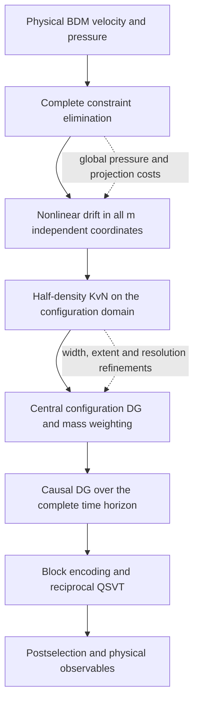

# From incompressible DG flow to a global KvN history system

`quest-cfd` starts with a complete finite-element approximation of an incompressible velocity field, transports probability over all its independent coordinates, and assembles that transport over an entire time interval as one linear system. This tutorial explains the mathematical objects that survive each change of representation. It describes the implemented research example, rather than asserting that every discretization or benchmark has converged.

[Jemcov and Morris](https://arxiv.org/html/2605.19187v1) provide the starting point: a symmetrically ordered Koopman–von Neumann generator and a discretization that preserves its adjoint identity. Their examples use spectral truncations and their finite-domain treatment includes an absorbing channel. This crate supplies complete physical BDM1/P0 and bounded BDM2/P1 DG spaces, central configuration DG, and a causal global temporal DG inverse. Those choices are extensions implemented here; the absorbing channel is not implemented. A separately truncated [Carleman history route](carleman-history.md) shares the complete physical dynamics and causal history machinery.

For the encoding, reciprocal transformation and execution model, continue with [quantum and distributed execution](quantum-and-distributed.md). The [alternatives](alternatives.md) compare other formulations; [NEXT_STEPS](../NEXT_STEPS.md) separates future work from present behavior. The [2026-10-04 verification record](../../../docs/verification/2026-10-04-quest-cfd.md) and [2026-10-05 implementation evidence](../../../docs/verification/2026-10-05-dual-history.md) identify the actual dated experiments; neither automatically validates later changes.

## 1. Three spaces, three different dimensions

A physical point is $x\in\Omega_x\subset\mathbb R^d$, with $d=2$ or $3$. The velocity field is $u(x,t)$. Its local DG coefficients form a real vector $c$. After eliminating all algebraic constraints, the complete independent coordinates are $a\in\mathbb R^m$. The phrase “independent coordinates” refers to a basis for the entire constraint kernel, not a selected subset of physical modes.

The configuration domain $\Omega_a\subset\mathbb R^m$ contains those vectors $a$. A probability amplitude $\psi(a,t)$ lives on this domain. Its discretization has $N$ coefficients, ordinarily much more than $m$. Configuration mass weighting gives $z=W^{1/2}\psi_h$, where $W$ is a positive configuration quadrature mass. The configuration generator is $G\in\mathbb C^{N\times N}$.

Finally, the history vector $x_H$ contains configuration amplitudes at every temporal DG node. With $n_t$ temporal coefficients it has $Nn_t$ entries. The history matrix is $A\in\mathbb C^{Nn_t\times Nn_t}$, and the global solve is $Ax_H=b$. These spaces should not be confused: physical DG resolution determines $m$, configuration resolution determines $N$, and temporal resolution determines $n_t$.

A three-dimensional flow over time is a four-dimensional physical space–time problem. The KvN lift is instead an $m$-dimensional configuration problem plus time, where $m$ counts the complete independent DG velocity coefficients across the mesh. Refining a physical three-dimensional mesh increases $m$ and therefore the exponent in the configuration tensor. Amplitude encoding reduces the number of index qubits; it does not remove the tensor's preparation, oracle, resolution or full simulated-state costs. The [generated KvN consumer](distributed-history.md#generated-full-coordinate-kvn-consumer) avoids storing its complete drift table, generator and RHS, while charging repeated complete physical-drift queries and coherent loading.

## 2. The physical incompressible problem

Using reference length $L_{\rm ref}$, velocity $U_{\rm ref}$, time $L_{\rm ref}/U_{\rm ref}$ and pressure $\rho_f U_{\rm ref}^2$, with constant fluid density $\rho_f$, the nondimensional equations are

$$
\partial_t u+(u\cdot\nabla_x)u-\nu\Delta_xu+\nabla_xp=0,
\qquad \nabla_x\cdot u=0,
\qquad \nu=\mathrm{Re}^{-1}.
$$

Some case manifests retain geometry coordinates whose unit length differs from $L_{\rm ref}$, for example a cylinder of diameter 0.1 in the declared channel coordinates. In those stored coordinates the viscosity coefficient is evaluated as $U_{\rm ref}L_{\rm ref}/\mathrm{Re}$; it becomes $\mathrm{Re}^{-1}$ when both reference scales equal one. Consequently the reference length in a manifest matters: an inverse wave number, cavity width and cylinder diameter are different conventions. The current physical references have no volumetric body force. Moving lids and prescribed inlet velocities act through boundary terms.

On each simplex $K$, BDM1 velocity is $[\mathcal P_1(K)]^d$, and P0 pressure is constant. There are six local velocity coefficients per triangle and twelve per tetrahedron. Their normal traces are affine on edges or triangular facets. Matching the normal trace at every facet vertex therefore matches the complete trace polynomial. Tangential traces remain discontinuous and are treated by DG terms.

For affine velocity, divergence is constant in each cell. An integrated cell-divergence constraint thus enforces pointwise divergence within that cell. Normal continuity makes the assembled field conform to $H(\mathrm{div})$. The divergence-free velocity formulation follows the setting described by [Fu](https://arxiv.org/abs/1808.04669); this crate documents its own central convection, SIP viscosity and bounded chart construction rather than claiming to reproduce all of that paper's operators or experiments.

## 3. Convection, viscosity and boundary work

For a divergence-free physical velocity and a test function $v$, the implemented conservative convective force has volume contribution

$$
 r_{\rm conv}(u;v)=\sum_K\int_K (u\otimes u):\nabla_xv\,dx
 -\sum_{f\text{ interior/periodic}}\int_f (u\cdot n)\{u\}\cdot[v]\,ds
 -\text{exterior flux terms}.
$$

Here a facet normal points outward from the chosen left cell, $[v]=v_L-v_R$, and $\{u\}=(u_L+u_R)/2$. Normal continuity makes the normal speed single-valued. On prescribed exterior facets the central transported trace is the average of interior and prescribed velocity; at a natural outlet it is the interior velocity. There is no sign-based upwind switch in this physical drift. Central flux keeps the coordinate ODE smooth and quadratic.

The viscous bilinear form is a symmetric interior-penalty Laplacian:

$$
 s_h(u,v)=\sum_K\int_K\nabla_xu:\nabla_xv
 -\sum_f\int_f\{\nabla_xu\,n\}\cdot[v]
 -\sum_f\int_f\{\nabla_xv\,n\}\cdot[u]
 +\sum_f\int_f\frac{\eta}{h_f}[u]\cdot[v].
$$

Exterior essential facets use the one-sided derivative and prescribed-trace consistency/penalty loads. Natural outlets omit these essential-boundary terms. The generic simplex implementation uses $\eta=40$ and $h_f=d\min(|K_L|,|K_R|)/|f|$, with a one-sided volume on exterior facets. The original two-triangle fixture uses its separate penalty convention, $\eta=20$.

The physical mass matrix integrates affine basis products exactly. Convection uses degree-two volume quadrature and degree-three facet quadrature, sufficient for its polynomial integrands. On homogeneous periodic or closed no-penetration domains, contraction of the convective force with $u$ cancels: transport redistributes kinetic energy. A coercive SIP form dissipates it through viscosity. Prescribed boundaries add work and open boundaries transport energy, so the closed-domain identity must not be imposed on an inlet/outlet case. Penalty sufficiency and numerical stability on general distorted meshes remain separate from checking symmetry or a few bounded energy identities.

## 4. Eliminating constraints without discarding velocity modes

Let $M$ be the physical mass matrix. Collect all normal-trace matching, prescribed normal traces and cell-divergence equations into

$$
 Cc=g.
$$

A stationary boundary lifting $\ell$ satisfies $C\ell=g$. The implementation constructs every column of a kernel basis $Q$ and mass-orthonormalizes it:

$$
 CQ=0,\qquad Q^TMQ=I_m,\qquad Q^TM\ell=0,
 \qquad c=\ell+Qa.
$$

Thus $m=\dim\ker C$. No POD selection, energy cutoff or modal truncation is introduced after choosing the physical DG mesh. Boundary constraints legitimately remove constrained coordinates; natural outflow retains its free normal degrees.

Write $r_h(c)$ for the full physical force vector, including convection, viscosity and stationary boundary loads. Testing momentum with the complete kernel gives

$$
 \dot a=F(a),\qquad F(a)=Q^Tr_h(\ell+Qa).
$$

Because the mass chart is orthonormal, no mass inverse appears in this expression. This equation assumes constant lifting; the separate [scalar time-dependent lifting](#scalar-time-dependent-boundary-lifting) retains its derivative and scaled boundary terms. The [complete polynomial-time box source](generated-time-boundaries.md) additionally supports independent polynomial lifting, prescribed traces and body forces. Nonpolynomial data and moving geometry remain unsupported by that source. For homogeneous lifting, kinetic energy is $E(a)=\tfrac12\|a\|_2^2$. For the minimum-mass lifting used in this stationary chart, $Q^TM\ell=0$, so

$$
 E(a)=\tfrac12(\ell+Qa)^TM(\ell+Qa)
      =\tfrac12\ell^TM\ell+\tfrac12\|a\|_2^2.
$$

The periodic unit square split into two triangles makes the accounting concrete. Twelve local velocity coefficients are constrained by six independent normal-trace equations across the diagonal and two periodic facet pairs. The two integrated divergence equations have one redundancy because the total divergence follows from periodic normal continuity. The constraint rank is therefore seven and $m=12-7=5$. Both uniform mean-flow modes remain. The generic triangular chart and original monomial fixture represent the same full space.

The chart is a mathematically complete representation, but global constraint elimination need not preserve computational locality. $Q$ can be dense; evaluating $F$ can mix all independent coordinates. The reference computes dense elimination and reorthogonalization and rejects more than 768 local velocity coefficients before full chart assembly. The separate [generated distributed box chart](physical-space.md#generated-constraints-and-distributed-complete-charts) retains local Householder factors and dense local fill rather than global $Q$; its factorization and globally coupled queries remain charged. Neither sparse configuration rows nor algebraic topology counts establish a scalable physical drift or an executed flow solve.

## 5. Pressure remains a physical diagnostic

The physical construction is implemented in [bdm.rs](../src/bdm.rs) and [simplex.rs](../src/simplex.rs); their broader case boundaries are described in the [foundation](../foundation.md).

Pressure has disappeared from the coordinate ODE because kernel tests annihilate constraint reactions. It has not disappeared from the fluid model. The code reconstructs the full acceleration, forms $r_h(c)-M\dot c$, and fits it using all normal-trace reactions and integrated-divergence rows. The P0 pressure is recovered with the implementation's sign convention, while hybrid normal multipliers represent the other constraint forces.

On a connected closed or periodic domain, pressure has one constant gauge freedom. The enforced gauge is

$$
 \sum_K |K|p_K=0.
$$

For unequal cell volumes this differs from an unweighted sum of coefficients. The recovery basis uses volume ratios when eliminating the final pressure unknown. Natural outlet traction instead fixes the pressure level; adding a mean-zero condition there would change the open-boundary problem.

Momentum residuals are checked in the original local coefficient equations, alongside divergence and prescribed-boundary residuals. These checks distinguish a valid complete constrained evolution from a coordinate calculation that merely looks divergence-free. They do not establish mesh accuracy: a coarse P0 pressure can satisfy its discrete equations while poorly resolving the physical pressure field. The [distributed supplied-force wrapper](physical-space.md#distributed-physical-pressure-from-a-broken-force) separately implements full P0/P1 pressure and compensating normal-multiplier gauge recovery; independent source review and pure/MPI 1/2/4/8-rank/split checks passed. The generated complete box force now supplies both autonomous and [polynomial-time distributed drift and KvN history](generated-time-boundaries.md). Time-dependent pressure uses the original acceleration $Q\dot a+\dot\ell$, and recovery rejects mixed prior query times/states before its globally coupled queries. These implementations retain full coordinates; their tiny MPI/reference checks are not physical convergence evidence.

## 6. From a nonlinear trajectory to linear probability transport

Consider an ensemble of complete DG states evolving under $\dot a=F(a)$. Conservation of probability gives Liouville's equation:

$$
 \partial_t\rho+\nabla_a\cdot(F\rho)=0.
$$

It is linear in $\rho$ even though $F$ is nonlinear. Write $\rho=|\psi|^2$ and evolve the half-density by

$$
 \partial_t\psi=\mathcal L\psi,
 \qquad \mathcal L\psi=-F\cdot\nabla_a\psi
                  -\frac12(\nabla_a\cdot F)\psi.
$$

Substituting this expression into $\partial_t(\psi^*\psi)$ recovers the full divergence term in Liouville's equation. The factor one-half is essential. Physical incompressibility $\nabla_x\cdot u=0$ does not imply $\nabla_a\cdot F=0$: they differentiate different vector fields on different spaces.

Formally, with real multiplication $\mathcal F_j$ and integration-by-parts-compatible derivatives,

$$
 \mathcal L=-\frac12\sum_{j=1}^m
       (\mathcal F_j\partial_{a_j}+\partial_{a_j}\mathcal F_j).
$$

Symmetric ordering accounts for the derivative acting on $F_j$ as well as on the amplitude. The formal adjoint argument requires vanishing boundary terms, through decay on an unbounded domain or compatible boundary data. The finite configuration closure used below is a separate numerical assumption. The half-density construction and its ordering are discussed by [Jemcov–Morris](https://arxiv.org/html/2605.19187v1); the formulas here are applied to the crate's complete DG drift.

Viscosity does not contradict norm-preserving amplitude evolution. For the illustrative contraction $F(a)=-\gamma a$,

$$
 \psi(a,t)=e^{m\gamma t/2}\psi_0(e^{\gamma t}a),
 \qquad \int_{\mathbb R^m}|\psi(a,t)|^2\,da=\text{constant}.
$$

The distribution becomes narrower and taller while its probability stays fixed. Its mean quadratic physical energy decreases. This example explains why dissipation can demand finer configuration resolution: concentration, rather than loss of amplitude norm, carries the contracting classical dynamics. The actual nonlinear convection's configuration divergence must be evaluated through the full drift; energy cancellation alone is not a divergence-free phase-space theorem.

## 7. Configuration DG and the weighted adjoint

The configuration grid is a tensor product over all $m$ coordinates. With $n_a$ cells per axis and polynomial order $p_a\in\{1,2\}$,

$$
 N=[n_a(p_a+1)]^m.
$$

Lobatto nodes on adjacent cells are independent DG coefficients even when their physical configuration locations coincide. Coordinate zero is the fastest tensor index. The positive diagonal mass $W$ is the tensor product of nodal quadrature weights. For DG2 it is a quadrature mass, not the exact continuous polynomial mass matrix.

Central periodic numerical traces produce differentiation matrices satisfying

$$
 D_j^\dagger W=-WD_j.
$$

Let $\mathsf F_j=\mathrm{diag}(F_j(a_i))$. Real diagonal drift multiplication commutes with $W$. The implemented split operator is

$$
 L_h=-\frac12\sum_j(\mathsf F_jD_j+D_j\mathsf F_j),
 \qquad L_h^\dagger W+WL_h=0.
$$

The mass-weighted amplitudes and generator are

$$
 z=W^{1/2}\psi_h,\qquad
 G=W^{1/2}L_hW^{-1/2},\qquad G^\dagger=-G.
$$

Consequently $\|z\|_2^2=\psi_h^\dagger W\psi_h$ represents quadrature probability. Raw nodal amplitude magnitudes must not be interpreted without mass weights. Drift samples are real complete vectors, and the sparse entries combine endpoint drift values with the derivative and square-root mass ratio. Tensor mass underflow and dimension/storage overflow are rejected.

Periodic configuration closure is an artificial domain choice. A quadratic CFD drift is generally not periodic across the chosen coordinate bounds. Discrete skew-adjointness remains an algebraic identity, but agreement with transport on the intended unbounded domain requires resolving the distribution and controlling artificial-boundary interactions. The code neither applies an absorber nor silently makes the physical drift periodic.

## 8. Consistency is a separate question

A matrix can be exactly skew-adjoint and still approximate the wrong transport. In particular, the periodic one-cell DG1 derivative vanishes. It conserves norm perfectly while failing to represent a nontrivial translation. The default smoke configuration therefore uses two cells per coordinate.

For a smooth, boundary-compatible exact half-density, insert its interpolated or projected coefficients $z_*(t)$ into the semidiscrete equation. Define the consistency defect

$$
 \tau_h(t)=\dot z_*(t)-Gz_*(t).
$$

If $e=z-z_*$, skew-adjointness gives the conditional estimate

$$
 \|e(t)\|_2\leq\|e(0)\|_2+
                 \int_0^t\|\tau_h(s)\|_2\,ds.
$$

This separates stability from consistency. Manufactured periodic constant-drift waves test the latter under refinement. Extending the argument to the desired nonlinear CFD distribution requires coefficient and solution regularity, adequate quadrature/resolution and compatible treatment of the configuration boundary. The identity alone proves neither domain-truncation accuracy nor a deterministic zero-width limit. At finite resolution the discrete derivative also lacks an exact continuum product rule. Norm preservation for the amplitude scheme therefore does not prove that its nodal squared amplitudes solve an independently chosen discrete Liouville density scheme. Their connection to the continuum density equation must be assessed through consistency and refinement.

## 9. One causal temporal system over the whole horizon

For $\dot z=Gz$, choose temporal slabs of width $\Delta t$ and Lobatto order $p_t\in\{1,2\}$. With reference derivative $D^t$, weights $w^t$ and basis indices $r,s$, weak temporal DG gives

$$
 K_{rs}=-D^t_{sr}w^t_s+
                 \delta_{r,p_t}\delta_{s,p_t},
 \qquad T_t=\mathrm{diag}(\Delta t\,w^t/2),
 \qquad B=K\otimes I_N-T_t\otimes G.
$$

The shared `HistoryDynamics` recipe also admits $\dot z=G(t)z+f(t)$.
At node $t_{c,r}$ the diagonal generator block is $-m_rG(t_{c,r})$
and the right-hand side receives $m_rf(t_{c,r})$, with
$m_r=\Delta t\,w_r^t/2$. Generator entries are visited once per node under
an admitted maximum count; the source uses one reusable vector. This supports
Carleman's external degree-zero source without adding a normalized constant
coordinate. The same assembly accepts full-coordinate KvN generators. The
history builder checks finite entries, coordinate bounds and concurrent storage;
recipe-internal construction and work retain their own budgets.

The previous slab's right trace enters the current slab's left test equation with coefficient $-1$. Only the first left equation receives $z_0$. The assembled $A$ is block lower triangular in slab order. It stores the whole requested horizon, including two separate traces at temporal interfaces. A solver may approximate its inverse globally; no sequence of classical nonlinear steps is substituted for this history construction.

Even when $G$ is skew-adjoint, $A$ is non-Hermitian because of the causal temporal traces. The implementation passes this matrix directly to singular-value transformation. It does not form $A^\dagger A$, which would change conditioning and the operator being encoded. History unknowns are spatially mass-weighted $z$ values; temporal quadrature weights remain separate metadata. A normalized entire history state is therefore not automatically a normalized final-time probability distribution.

For DG1,

$$
 K=\begin{pmatrix}1/2&1/2\\-1/2&1/2\end{pmatrix},
 \qquad \frac{B+B^\dagger}{2}=\frac12I
$$

when $G$ is exactly skew-adjoint. For each stored slab, outward interval arithmetic forms $H=(B+B^\dagger)/2$ and proves $c=\min_i(H_{ii}-\sum_{j\ne i}|H_{ij}|)>0$. This preserves the sign of dissipative diagonal terms and also applies to nonnormal Carleman histories; it does not infer norm decay from eigenvalues. Then $\|B^{-1}\|_2\leq c^{-1}$. The off-diagonal causal trace blocks have norm one. For $n_s$ slabs, the finite triangular inverse expansion yields

$$
 \|A^{-1}\|_2\leq\sum_{k=1}^{n_s}c^{-k},
 \qquad \sigma_{\min}(A)\geq
                  \left(\sum_{k=1}^{n_s}c^{-k}\right)^{-1}.
$$

A sparse outward bound on $\sqrt{\|A\|_1\|A\|_\infty}$ supplies the upper endpoint. The bound can deteriorate rapidly with the number of slabs; it establishes an enclosure, not favorable long-time complexity. Failure of the sufficient bound or representability rejects built-in spectral admission.

DG2 uses a separate inverse-preconditioner argument. Its temporal matrix and
exact inverse are

$$
K_2=\begin{pmatrix}
1/2&2/3&-1/6\\-2/3&0&2/3\\1/6&-2/3&1/2
\end{pmatrix},\qquad
Q=K_2^{-1}=\begin{pmatrix}
1&-1/2&1\\1&5/8&-1/2\\1&1&1
\end{pmatrix}.
$$

For every stored diagonal slab $B_c$, interval arithmetic encloses
$E_c=(Q\otimes I)B_c-I$. Sparse absolute row and column sums give
$\delta\geq\max_c\|E_c\|_2$. Since $\|Q\|_2\leq3$, when
$\delta<1$ the Neumann estimate gives $\|B_c^{-1}\|_2\leq b=3/(1-\delta)$.
The same causal expansion then yields
$\sigma_{\min}(A)\geq(\sum_{k=1}^{n_s}b^k)^{-1}$.
This proof includes the rounding in the stored temporal matrix and works for
nonnormal, time-dependent generators when the residual bound is admitted.
It does not infer norm decay from negative eigenvalues. A rejected bound leaves
construction and other independently supplied evidence conceptually distinct.
The reference tests check a forced manufactured solution at every DG node and
compare a small nonnormal history against an independent dense inverse.

## 10. Initialization, observables and independent error budgets

The implemented initial amplitude is a compact smooth product bump centered at $a_0$, with width $\epsilon$:

$$
 \psi_{0,\epsilon}(a)\propto
 \prod_j\begin{cases}
 \exp[-1/(1-r_j^2)],&|r_j|<1,\\
 0,&|r_j|\geq1,
 \end{cases}
 \qquad r_j=(a_j-a_{0,j})/\epsilon.
$$

Sampling and multiplying by $W^{1/2}$ precede discrete normalization. An unresolved or underflowed bump is rejected. Its probability density is the square of this amplitude; it is not a single deterministic DG state. A point mass is a probability measure rather than a square-integrable half-density. Recovering a deterministic trajectory as the regularization width vanishes is a separate weak-limit question, unestablished by the recorded smoke result. For a possibly subnormalized vector, observables divide by $P=\sum_i|z_i|^2$, while retaining $P$ separately:

$$
 \mathbb E_h[O]=\frac1P\sum_i|z_i|^2O(a_i).
$$

The code reports coordinate means, variances, physical kinetic energy and probability in outermost configuration cells. Physical reference enstrophy is $\tfrac12\sum_K\int_K|\nabla_x\times u|^2$, using the broken, cellwise curl rather than a distributional curl containing facet jumps. Reported gradient dissipation is $\nu\sum_K\int_K|\nabla_xu|^2$ with the broken gradient. It is not the complete SIP energy form, which also contains consistency and penalty terms. Volume-mean outputs divide these integrated diagnostics by physical domain volume. On a two-cell axis every cell is an outermost cell: smoke boundary probability near one cannot establish negligible truncation leakage. Narrowing $\epsilon$, expanding the domain and refining the grid are different experiments; narrowing an unresolved bump changes the numerical problem rather than demonstrating convergence.

The classical transport comparison independently evolves the same complete DG ODE from each occupied initial configuration point, weights trajectories by initial probability, and compares ensemble means and energy with the lifted calculation. Both references use classical RK4 and expose integration error. Agreement is evidence about that ensemble and discretization, not quantum execution or every physical benchmark. The [KvN refinement receipts](kvn-refinement.md) separate configuration/order/width probes from corrected fixed-spacing domain probes, preserve support-policy rejection and show unresolved boundary occupation. Their RK4 time study is distinct from [temporal DG history refinement](../../../docs/verification/2026-10-05-dual-history.md#independent-temporal-refinement).

The dated smoke receipt records $m=5$, $N=1024$, one DG1 slab, history dimension 2048 and horizon 0.01. Scalar and QuEST CPU circuit simulations reported relative history residual about $5.26\times10^{-6}$. Their five-coordinate physical state is complete, but the configuration grid and initial width are coarse. The receipt explicitly leaves physical convergence unestablished. [Recorded construction and execution](../../../docs/verification/data/2026-10-04-quest-cfd/smoke.json).

A defensible convergence study keeps physical mesh/order, initial regularization width, configuration domain, configuration resolution, temporal resolution and algebraic inverse accuracy independently visible. Encoding, circuit execution and observable sampling add further errors. A small $\|Ax_H-b\|/\|b\|$ checks the assembled history system; its translation to solution error also depends on conditioning. It cannot by itself bound any of the preceding physical approximation errors. The separate [next-steps plan](../NEXT_STEPS.md) states which of those acceptance requirements remain open.

## Scalar time-dependent boundary lifting

The bounded simplex reference supports a fixed geometry and constraint kernel
with every prescribed velocity trace multiplied by a differentiable scalar
`g(t)`. If `l` is the complete minimum-mass lifting and `Q` is the complete
homogeneous mass-orthonormal chart, reconstruction and evolution are

\[
 u=Qa+g(t)l,\qquad
 \dot a=Q^T\{r_h(Qa+g l,g)-M l\dot g\}.
\]

The residual rescales both the SIP prescribed trace and the exterior convective
trace. Pressure reconstruction uses the full physical acceleration
`Q a_dot + g_dot l`. Although `Q^T M l` is zero to the accuracy of the chart,
the derivative term is retained explicitly. The public
`drift_with_boundary_scale` and `reconstruct_pressure_with_boundary_scale`
methods take both `g` and its derivative; callers cannot omit the derivative
by passing only a time-dependent velocity.

`PolynomialOde::from_simplex_bdm1_affine_boundary` supports
`g(t)=offset+rate*t` through bounded centered polarization of the known quadratic
residual. MathCore retains the resulting exact dyadic coefficients and treats
time as the final external symbol. All physical coordinates remain present;
time is not added as a physical coordinate in the lift. The adapter reports
its numerical extraction probes and roundoff diagnostic. General independent
boundary functions, moving geometry and convective-outlet dynamics are separate
formulations, not consequences of this scalar-lifting API.

## Complete polynomial-time box lifting and body force

The [generated time-data API](generated-time-boundaries.md) retains every owned
cell's full polynomial coefficients for `ell(t)`, prescribed exterior traces and
body acceleration. It supports uniform BDM1/P0 and BDM2/P1 periodic or prescribed
Dirichlet boxes in two and three dimensions. MathCore prepares the time powers
and their derivatives once. A fixed collective halo checks each coefficient's
complete divergence and normal-trace constraints, including prescribed nonzero
normal data. There is no global lifting, mesh or chart matrix in this producer.

For a supplied compatible lifting, including any homogeneous component, the
complete equation is

\[
 c=Qa+\ell(t),\qquad
 \dot a=Q^T\bigl[f_h(c,g(t),b(t))-M\dot\ell(t)\bigr].
\]

The original force and the effective force after subtracting `M ell_dot` remain
separate. Pressure reconstruction checks the original momentum equation with
`Q a_dot + ell_dot`. An arbitrary supplied lifting need not be mass-orthogonal
to `Q`; its energy is the complete quadratic form
`0.5*(Q a + ell)^T M (Q a + ell)`, including the cross term. No homogeneous
lifting component is discarded to recover the stationary simplification above.

`prepare_time_box_kvn_history_inverse` evaluates this drift at each actual
left/right temporal quadrature time under the fixed collective row schedule.
Time stays an external parameter, and body acceleration changes the drift rather
than creating an additive KvN amplitude source. This is the existing mass-lumped
temporal DG rule, not exact integration of arbitrary high-degree time products.
Complete DG1/DG2 history comparisons and nonzero inverse preparation are tested;
they do not claim a time-dependent inverse replay or physical convergence.

The implementation charges owned source storage, constraint factorization and
queries, coefficient evaluation, collective identity checks and global history
construction. Numerical coefficient/pressure residuals are not exact rank or
constraint certificates. Mixed/curved generated meshes, nonpolynomial boundary
data and the literal Neumann-farfield/convective-outlet wake remain separate
requirements; natural traction is not relabeled as those boundary conditions.
