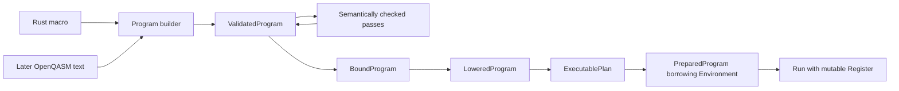

# Idiomatic Rust QuEST and a general circuit compiler

Status: approved by the user on 2026-09-10; initial M0–M5 implementation verified for the documented Linux GNU recipe and macro profile. See the [implementation ledger](../plans/implementation-status.md) for results and precise implementation boundaries.

Lifecycle update, 2026-09-11: the close/recovery design below is superseded by
the approved [RAII-only environment lifecycle](2026-09-11-raii-environment.md).
The facade now finalizes automatically at scope exit and permanently retires
QuEST after a failed cleanup. Dated audit and verification evidence is preserved.

Date: 2026-09-10. Baseline: `quest-rs` commit `6f2e5d5`; native QuEST installation `/var/home/erich/Projects/opt/quest`, source `/var/home/erich/Projects/QuEST`.

The user selected **Rust macro first, OpenQASM text import/export later**. This proposal covers the complete direction, with separately deliverable milestones. The accompanying [audit](2026-09-10-quest-bridge-audit.md) records existing defects and validation limits; the [research notes](2026-09-10-quest-circuit-research.md) record sources and optimization assumptions.

## Accepted workspace and numerical decisions

All crates now live below `crates/`, including facade `crates/quest`. The root is
virtual, resolver 3, with explicit members and facade default membership. Shared
metadata, dependency constraints and lints are inherited; feature selection
belongs to consumers. The workspace pins nightly-2026-09-06 and retains one root
Cargo.lock for locked validation. Dependency additions use cargo-edit.

Dense mathematics uses faer 0.24.4 with defaults disabled and `std`/`linalg` only.
Its complex scalar is compatible with num-complex 0.4. Payloads own immutable
faer matrices; logical view conversion handles padding, strides and conjugation.
Products and residuals request `Par::Seq`; allocation admission includes padding
and bounded scratch, using fallible matrix reservation. Numerical operators mean
A|psi> or A rho A† and never gain exact symbolic inverse privileges. Bounded
fusion preserves order and reports its empirical numerical character.

The dependency split is thiserror in libraries, anyhow at tooling entrypoints,
optional codespan-reporting source rendering, private petgraph 0.8, syn 3 and its
procedural macro helpers, exact num-rational/num-bigint 0.4 angles, optional
ndarray 0.17 without BLAS, and shared cmake-file-api discovery in quest-build.
CXX and xtask-only clang remain. Mandatory miette and cmake-package are removed.

The verified Linux development loader policy uses explicit absolute DT_RPATH
with a recorded native dependency closure, including GPU indirect libraries.
Every final executable invokes quest-build using the same QUEST_NATIVE_CONFIG.
This is a deliberately non-relocatable recipe; no installed ELF is patched.
The dated audit below remains baseline evidence, separate from implementation
follow-up results. Other platform/cross/deployment recipes remain unsupported.

## 1. Recommendation and alternatives

Build a small pure Rust circuit/compiler core, a procedural macro frontend, and an environment-bound native runtime. Preserve mathematical semantics and ownership guarantees before pursuing optimization or compatibility.

| Approach | Benefit | Cost / limitation |
|---|---|---|
| **Separate circuit core, macro, and runtime — recommended** | Circuit construction, analysis, and most testing need no native install; the runtime owns native resources; later frontends reuse semantics | A few explicit crate interfaces |
| Put all functionality into the existing root crate | Fewer packages initially | Native discovery infects frontend builds and tests; frontend/compiler/runtime boundaries become harder to enforce |
| Adopt an existing quantum compiler IR as the public model | Access to existing tooling and advanced passes | Its language, dependencies, semantics, and release cycle become public commitments; translation still requires verification |

Use existing graph and parsing utilities internally. Keep quantum semantics, invariants, and public identifiers under this project's control. External optimizers can later consume and return checked unitary regions through explicit adapters.

## 2. Crate and module boundaries

| Crate | Responsibility | Native dependency |
|---|---|---|
| `quest-rs`, exposed as Rust library `quest` | Public facade; environment, registers, matrices, observables, channels, execution, error conversion | `quest-sys` |
| Existing `quest-sys` | CXX bridge, safe adapter preconditions, native ownership, discovery and ABI evidence | QuEST 4.3 |
| New `quest-circuit` | Values, expressions, gate definitions, semantic programs, block DAGs, validation, analyses, transformations, source provenance | None |
| New `quest-macros` | Token-tree parser, diagnostics, hygienic expansion into the circuit builder | None |
| Small new `quest-build` helper | Final-target runtime-path emission and reusable build configuration support | Build-time discovery only |
| Later `quest-qasm` | Text parser/exporter implementing an explicitly versioned OpenQASM profile | None |

Retain Cargo package identity `quest-rs`; `[lib] name = "quest"` now supports `use quest::...`. This is a documented source migration from `quest_rs` at the next pre-1.0 release. Keep `quest-sys` named as it is. Users needing only circuit tooling depend on `quest-circuit` and its optional macro re-export.

`quest-macros` emits calls to `quest-circuit`; it need not depend on that crate as a runtime library. `quest-circuit` may depend on/re-export the proc macro, avoiding a dependency cycle. Resolve renamed dependencies in macro expansion and test facade and direct-crate use. Never require consumers to import an internal implementation crate merely for expansion to work.

Start optimization as modules in `quest-circuit`, not another crate. Keep CXX types private to the public runtime. Use `num_complex::Complex64` for public complex values; make ndarray interoperability optional and avoid requiring BLAS merely to copy amplitudes. Keep rich source diagnostics in frontend layers; runtime errors remain structured and inspectable.

## 3. Safe runtime, strong values, and native ownership

### Environment

`EnvironmentBuilder::build()` returns the sole active `Environment` guard. Existence of this guard represents successful initialization; a separate generic state parameter is unnecessary unless it changes available operations. The original consuming `close()` and recoverable shutdown error design is superseded by automatic non-panicking `Drop`. Native initialization may be entered only once per process; finalization or failed cleanup permanently ends QuEST use. See the [lifecycle update](2026-09-11-raii-environment.md) for the terminal-retirement policy.

Use explicit configuration enums, such as `ExecutionMode::{Auto, Enabled, Disabled}`, in place of positional booleans. Validate requested modes against installed capabilities before invoking native initialization. Record actual capabilities separately from requested configuration.

The bridge owns the process-wide lifecycle state machine: unattempted, initializing, active, finalized/failed. Remove the unused second singleton in the public layer. Guard initialization/finalization/resource admission as complete operations; atomic counters alone do not prevent races. Start with one supported calling thread for native operations, checked at the bridge boundary, and no `Send`/`Sync` for runtime owners. Admission covers every native call, global getter/setter, and handle destructor, including direct safe bridge use. Native OpenMP parallelism is independent of calling QuEST concurrently from Rust.

Direct safe `quest-sys` calls must obey the same lifecycle and validation policy. A high-level lifetime cannot protect against a second crate calling unsafe native lifecycle functions through an otherwise safe bridge. Pre-initialization checks cannot promise recovery from every native fatal failure; describe the remaining native initialization behavior honestly.

### Registers and other resources

`Register<'env, StateVector>` and `Register<'env, DensityMatrix>` own opaque RAII handles and borrow the active environment. Environment factory methods are their only safe constructors. Matrix, diagonal matrix, channel, observable, and prepared-execution owners that require native lifetime protection follow the same pattern.

Provide kind-specific methods: amplitudes on state vectors, density entries on density matrices, and noise channels only where a backend capability supports them. Promotion from a state vector to a density matrix is an explicit fallible allocation. Cloning a register is an explicit deep operation, not an accidental cheap `Clone` contract.

All dimensions, products, byte sizes, shifts, and FFI integer conversions are checked before native calls or allocation. Provide bounded range reads and streaming/chunked exports in addition to convenience full-state materialization. Specify density matrix row/column order and qubit endianness in one place and test them against asymmetric examples.

Use private-field value types for `QubitCount`, register indices, `Probability`, finite radians, measurement `Outcome`, shot count, and named backend configuration. Logical circuit wires, physical/backend indices, classical storage locations, and classical values are distinct types. A newtype alone does not establish an index's membership in a register or program: constructors and use sites check ownership and bounds.

The existing error skeleton should become the actual public `quest::Result`, retaining backend causes and operation context. Add allocation, unsupported capability, binding, and execution-location errors as needed. Remove the demonstration `add()` API and placeholder example when replacing the facade.

### Safety and failure boundaries

Keep backend validation enabled throughout safe operation. Remove validation-disable APIs from the safe generated surface; if retained for advanced interoperability, place them behind a documented `unsafe` contract that covers subsequent operations, unwinding, other crates' calls while validation is disabled, and restoration. Audit configurable validation tolerances and other global setters too. Never weaken memory-safety preconditions because a caller requests less numerical checking.

Matrix admission distinguishes a finite, shaped matrix from an operator admitted as approximately unitary under an explicit tolerance. A tolerance-checked matrix is not an exact symbolic unitary and cannot acquire exact cancellation privileges. Validate Kraus completeness/physicality under a stated numerical policy for supported channel constructors.

Initially `UnitaryCircuit` admits built-in exact gate semantics and their symbolic compositions. Arbitrary floating matrix payloads use an explicit numerical-operator path in `Program`; passing an approximate unitarity check does not upgrade that capability. Such payloads may expose `conjugate_transpose`, but the DSL's `inv` modifier and exact inverse cancellation do not apply to them. For a floating matrix A, approximate A-dagger A = I does not establish that A-dagger is A-inverse. A future intended-unitary realization type would need its own target semantics and numerical evidence.

Preparation is transactional: native objects and scratch are built privately and dropped on failure before publishing a prepared owner. Execution is not transactional by default: an error may leave the register partially modified. Return the failing operation and completed-prefix context. Offer snapshot-based execution only as an explicit future cost, not an implied guarantee.

Even safe Rust can leak owners with `mem::forget`; native live-resource checks must still reject premature finalization. Destructors must not panic or let exceptions cross FFI. If shutdown cannot safely occur, preserve native state rather than claiming successful finalization. Under the 2026-09-11 lifecycle update, failed environment cleanup permanently retires all native admission while the process continues.

## 4. General circuit representation

### Semantic program and dependency graph

The QSVT implementation shares expression trees for sequence, adjoint, control, and qubit shifts. Reuse its ownership and staging lessons, but distinguish three structures:

1. A semantic program owns ordered operation occurrences, reusable gate definitions, parameters, source spans, and regions.
2. Each straight-line region owns or derives a directed dependency graph over those occurrences.
3. A compiled plan contains deterministically ordered native actions and resource requirements.

Sharing a gate definition or matrix payload must never merge repeated applications. Every occurrence has its own stable identity and provenance. An optimizer records the input occurrences contributing to each new operation, and records removals separately.

Use a private `petgraph::StableDiGraph` initially, with explicit quantum-wire, classical-value, storage-hazard, barrier, and stochastic-order dependencies. Petgraph is a graph implementation, not a validity proof. Public IDs are program-owned IDs checked for membership; raw `NodeIndex` values never escape. Deleted internal slots can be reused, so public IDs must not alias those slots. Validate acyclicity after graph-changing passes and choose ready operations by a documented stable occurrence-order tie-break.

For mutable classical storage, retain source-level locations but lower their reads/writes into versioned values. Edges cover definitions and uses and preserve write/read/write ordering where storage remains mutable. The first version can conservatively order effects; optimize that only after the hazard model is tested.

Initially preserve program order for every operation touching a common qubit, including controls, and for stochastic events. A valid topological order does not authorize concurrent mutation of one native register. Execution is serial at the bridge boundary; the backend performs its own internal parallel work.

### Operations and capabilities

The core vocabulary supports unitary application, explicit global phase, measurement with classical results, reset, supported channels, classical predicates, and scoped barriers. Reusable unitary gate definitions own an ordered argument interface and parameter interface. Ordered matrix targets must remain ordered; controls may be canonicalized separately after checking uniqueness and target/control disjointness.

Validate the gate-definition reference graph separately from block scheduling DAGs: unitary definitions cannot recurse, every call matches its signature, and expansion/decomposition respects checked depth, occurrence-count and storage budgets. Sharing definitions does not exempt their expanded uses from resource limits.

`UnitaryCircuit` is an admitted capability over program data and exposes `adjoint` and coherent `controlled` composition. `Program` includes measurement and other effects and exposes neither operation generically. A general program can be checked and converted into a unitary circuit when its complete contents qualify. Keep semantic capability separate from compilation stage.

`Control { qubit, state: Zero | One }` is distinct from a classical `if`. Measurements consume/update quantum state and define classical values; their writes are not treated as gates. Do not eliminate a measurement merely because its classical result is unused: its state disturbance remains observable. Reset and channels also remain effectful.

Classical `if`, bounded loops, and later runtime loops are structured regions with explicit arguments, results, and effect summaries. A runtime loop is not a cycle inserted into a circuit DAG. Initial frontend and execution support may reject such regions until the relevant milestone; the model reserves the semantic boundary without claiming unimplemented behavior.

### Angles, phase, and numerical meaning

Use owned expressions for exact rational multiples of pi, typed parameter slots, and finite floating constants. The initial implementation uses a closed value enum with arbitrary-precision rationals; a general expression arena is reserved for richer symbolic expressions. Arithmetic never wraps. Canonicalize only a documented algebraic subset. Treat floating constants as opaque values for exact rewrite decisions; do not declare a small angle equal to zero using a hidden epsilon. Parameter sums remain separate operations in the initial optimizer.

Preserve global phase through all compositional operations. In particular, controlling `exp(i phi) U` makes the phase relative to the inactive-control branch. `Rz(2 pi) = -I`, so reducing rotations modulo `2 pi` without a compensating phase is invalid for phase-sensitive circuit equivalence. Matrix decomposition and OpenQASM gate definitions must use explicit, pinned phase conventions.

Specify three separate contracts: exact ideal-circuit algebra, bounded numerical approximation, and backend execution reproducibility. Algebraically exact rewrites can change floating-point roundoff. Stable scheduling does not promise bit-identical CPU/GPU/MPI results or identical samples across different backend versions.

## 5. Owning compilation stages and execution



Each transition consumes its input or produces a new immutable owner. Private constructors enforce stage invariants. `ValidatedProgram` has resolved names, well-typed expressions, valid operands, effects, and acyclic block graphs; it may contain declared parameter slots. `BoundProgram` owns complete finite bindings. `LoweredProgram` has supported operations, validated decompositions and checked native representability. `ExecutablePlan` owns deterministic instruction order, budgets, register-kind requirements, and binding/backend provenance. `PreparedProgram<'env>` adds native RAII caches and exclusive mutable scratch.

Optimization returns a newly validated program plus a transformation report. Numerical passes that require values run only after binding, through the same invariant boundary. Do not let a pass mutate a program while a previously admitted or prepared view points into it. No public `mark_validated` escape hatch exists.

Pure immutable circuit data can be shared with `Arc` and processed in parallel. Prepared native owners remain on the supported calling thread. Cached plans include all relevant parameter values, numeric policy, backend capabilities, and target layout. Hashes select cache candidates; equality or complete immutable identity confirms a hit.

Preparation records the numerical admission policy and the native/FP configuration on which its checks depend. Before mutating a register, execution checks required rounding/underflow modes and safety-relevant native configuration against that record. Reject incompatible ambient changes before execution; capability or admission-policy changes require a new preparation. Where no certified approximation bound is produced, report empirical numerical validation as such. Immutable Rust types do not make ambient FP state immutable.

`run` mutates one supplied register and returns classical results plus run metadata. `sample` takes an explicit initial-state preparation policy and repeats shots from that state, rather than continuing from the previous shot's collapsed state. Reset semantics are explicit for state-vector trajectories versus exact density channels. Initially support channels on density matrices; stochastic unraveling of arbitrary noise is a later capability.

Record explicit seeds and stochastic occurrence order. QuEST uses process-wide configuration/RNG state: do not claim independent session RNGs merely because a Rust object contains a seed. Serialize native seed changes and execution and define seeding at the run/batch boundary. Keep initialization, binding, optimization, lowering, preparation, execution, and result extraction independently measurable. The initial implementation reports optimizer elapsed time; it does not yet automatically instrument every stage or claim benchmark results.

## 6. Macro-first DSL

Implement `circuit! { ... }` as a procedural macro parsing Rust token trees directly. Syntax and static name/arity errors receive source-local compiler diagnostics. Runtime values and dimensions use the same fallible builder admission as ordinary Rust callers. Macro expansion never initializes QuEST or performs simulation.

First profile: statically sized `qubit`/`bit` declarations; indexed operands; a documented standard gate set; exact pi-based angles and finite bound angles; explicit global phase; positive/negative coherent controls and inverse modifiers; per-qubit measurement, reset, and scoped barriers. Reject unsupported tokens and constructs with a capability-specific message. Gate inventory begins with `id`, `x/y/z`, `h`, `s/sdg`, `t/tdg`, `sx`, `rx/ry/rz`, `p`, `cx/cy/cz`, `swap`, `ccx`, and phase-specified `U`. Core gate semantics govern adjoint and lowering; exhaustive macro/builder inventory tests currently check the separate frontend spelling/arity table. Generating both from a shared registry remains an internal maintenance improvement.

The name is an **OpenQASM-style Rust DSL**, with gate semantics pinned to OpenQASM 3.1.0. It is not a claim of full OpenQASM conformance. Rust tokenization cannot represent every OpenQASM lexical feature faithfully. Do not stringify token streams and pretend the result is the original source text.

Implemented syntax (fallible calls shown inside a function):

```rust,ignore
use quest::{circuit, Environment, Shots};

fn main() -> Result<(), Box<dyn std::error::Error>> {
let bell = circuit! {
    qubit[2] q;
    bit[2] c;
    h q[0];
    cx q[0], q[1];
    c[0] = measure q[0];
    c[1] = measure q[1];
}?;

let env = Environment::builder().build()?;
let mut executable = env.prepare(bell)?; // convenience path through explicit stages
let counts = executable.sample_zeroed(Shots::new(1024)?, &[2026, 9, 10])?;
Ok(())
}
```

Runtime Rust expressions use an explicit interpolation form such as `${theta}`. Parse the expression with Rust syntax, evaluate it exactly once in source order during construction/binding, and store its admitted value. The optimizer never duplicates, eliminates, or reorders host-language side effects. Reusable symbolic parameters are named slots bound separately; their semantics do not depend on evaluating arbitrary Rust code during optimization.

Later increments add user gate declarations and structured classical control, then a text frontend with its own lexer/parser over the shared semantics. Text includes use an explicit source resolver; initial support for `stdgates.inc` uses the pinned definitions. Export validates representability and reports unsupported extensions instead of silently discarding them. Text round trips compare semantics and phase, not formatting identity.

## 7. Transformation policy

Default passes preserve phase-sensitive ideal semantics and respect all quantum/classical effects. There is a no-optimization reference path. Every pass states its supported domain, preconditions, preserved analyses, cost objective, numerical policy, and rejection behavior.

Start with exact identity removal, inverse cancellation for known symbolic gates, same-axis symbolic rotation combination with phase accounting, and explicit gate decomposition with tested matrix conventions. Restrict movement to proven commuting operations within unitary regions. Matrix payloads and gate definitions may be interned by exact equality; operation occurrences may not.

Explicit channels are program effects. A separately configured noise model injected after compilation describes the compiled implementation, which differs from injecting noise after every original source gate. Name that policy and keep it stable; do not remove source gates while implicitly claiming preservation of a source-gate noise experiment.

Follow with capability-limited Clifford and phase-polynomial optimization. Simulator fusion belongs in backend planning with strict target-count and memory budgets; fewer logical gates do not necessarily mean faster QuEST execution. Hardware topology routing is an optional future target, because SWAP insertion is generally an unnecessary cost for a simulator.

Approximate single-qubit synthesis, numerical resynthesis, and ZX-based global rewrites are opt-in later work. An approximation policy names a distance metric, per-region budget, composition rule, phase contract, and how evidence was obtained. Do not combine incompatible error measures or use measured matrix closeness as a formal bound. The supplied Booth paper motivates single-qubit search acceleration, not a general-purpose DAG optimization framework.

## 8. QuEST 4.3 readiness and runtime paths

Make the tested compatibility policy explicit: QuEST 4.3.x, binary64, deprecated APIs off; regenerate against the selected installed headers and record the exact version/configuration. Do not silently accept all later 4.x releases, or require patch zero without a documented ABI reason. Track generated, manual, RAII, intentionally excluded, and unsupported functions accurately by native signature.

Cargo link arguments from a library build script do not automatically configure arbitrary downstream executables, and native metadata travels only to immediate dependents. Supply a final-target `build.rs` recipe backed by `quest-build`. Keep metadata for direct consumers and explain the additional helper needed beyond that dependency boundary. Test `application -> wrapper library -> quest` as well as direct use. A Cargo configuration local to this repository is not a consumer distribution strategy. [Cargo build script contract](https://doc.rust-lang.org/cargo/reference/build-scripts.html).

`quest-build` owns one pure discovery/configuration implementation used by both the `quest-sys` build script and the final-target helper. For the verified consumer recipe, an xtask configuration command writes an authoritative native record selected through `QUEST_NATIVE_CONFIG`: canonical prefix, target triple, exact version/features, library paths and content identities. Both build scripts read and validate that same record, watch it and its native inputs for changes, and reject mismatches. Legacy `QUEST_ROOT` discovery remains convenient, but is not described as an attested transitive configuration. The helper must not depend on `quest-sys` as a build dependency merely to obtain metadata; a host build instance does not attest the target runtime library. Conflicting per-package native-link overrides are outside the verified recipe unless they consume the same record.

Separate executable-to-QuEST lookup from the native shared-library dependency closure. The current installation's cuQuantum dependency cannot find its indirect cuBLAS libraries with loader variables unset. An executable's `DT_RUNPATH` is not recursively inherited by every dependency. The native package must carry appropriate per-library paths or use a documented deployment/loader configuration. Diagnose that during setup; do not claim that adding the CUDA directory to one RUNPATH solves all indirect dependencies.

For local development, emit selected absolute runtime paths into final targets. For relocatable deployment, make the bundle layout and `$ORIGIN`/`@loader_path` policy explicit and verify the complete copied library closure. Do not copy arbitrary libraries or silently patch the installed QuEST tree during a Cargo build. Static QuEST needs PIC and all transitive native link requirements; “static QuEST” does not imply a fully static executable. macOS and Windows behavior require their own verified recipes.

## 9. Delivery milestones and acceptance

| Milestone | Deliverable | Exit evidence |
|---|---|---|
| M0: bridge readiness | Safety controls, lifecycle synchronization/thread policy, manual adapter fixes, 4.3 generator metadata, runtime-path support | Safe invalid inputs cannot bypass validation; standalone direct and wrapped consumer runs outside Cargo; generator freshness and accurate coverage; native closure diagnosis resolved for the selected test environment |
| M1: public runtime | Environment-bound typed registers/resources, checked values/errors, useful examples | Compile-fail lifetime/kind/thread checks; lifecycle subprocess tests; Bell and asymmetric matrix numerical fixtures; shape/overflow/allocation-limit checks |
| M2: pure circuit core | Builder, expressions, unitary/program distinction, dependency DAGs, source provenance, immutable stages | Tests run without QuEST; operand/control order, repeated occurrences, classical hazards, phase, invalid IDs and cycles covered |
| M3: execution | Binding/lowering/planning/preparation, common gates, measurement/reset, density channels, explicit sampling | Differential direct-call versus circuit execution, shot reset behavior, partial-failure semantics, resource rollback, seed metadata |
| M4: macro frontend | Initial documented DSL profile and diagnostics | Macro/builder equivalent semantics; compile-fail syntax, invalid arity and unsupported features; runtime interpolation evaluated once; renamed dependency cases |
| M5: conservative optimization | Exact local passes and bounded simulator fusion | Original/optimized differential fixtures, phase-sensitive controlled embeddings, effect barriers, pass idempotence where promised, depth/gate/memory/timing reports |
| Later, separate specs | Structured classical frontend support, text QASM import/export, advanced synthesis/ZX/routing | Versioned language conformance and capability tests; pass-specific equivalence/error evidence |

M1 and the pure M2 work can proceed independently after the shared design is approved; native M3 depends on M0/M1/M2. The macro can develop against M2 in parallel with execution. Integration acceptance covers the full chain, not merely each package's focused tests.

Use `googletest` runtime assertions and preserve the serialized native test group. Extend native test isolation to public runtime tests. Nextest process isolation and serial scheduling are different guarantees; lifecycle tests that initialize/finalize or deliberately trigger native failure need subprocess isolation even under ordinary `cargo test`.

For small unitary cases compare full matrices, including phase, and action on asymmetric complex inputs. For channels and dynamic measurements compare density evolution and branch probabilities/classical results; statevector fidelity alone is insufficient. Random fixtures supplement explicit regression cases, not formal equivalence proofs. Compile-fail tests establish that lifetime/kind/Send restrictions are enforced by the public API. Fuzzing of macro-independent parser/IR admission can be added once those boundaries exist.

Run the repository's build, Nextest, doctest, formatting, Clippy, examples, and generator freshness commands. Record failures and skipped platform/backend coverage explicitly. Pin and record toolchain, QuEST configuration, pass settings, seeds, and hardware for numerical/performance results. Benchmarks separate construction, compilation, preparation and repeated execution, and compare relevant simulator cost rather than assuming a gate-count improvement is a speedup.

## 10. Approval scope

Approval accepts these ownership, graph, numerical, macro-profile, and runtime-path boundaries and authorizes implementation of M0–M5. Their initial implementation and acceptance evidence are now recorded in the ledger. Each stage remains independently reviewable in the source and Git history. General structured regions, richer expression infrastructure, advanced language support and research optimizers remain future directions; the ledger distinguishes them from delivered behavior.
